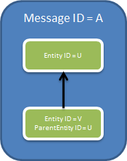
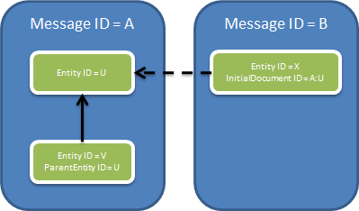

Модель данных
=============

Диадок предназначен для обеспечения юридически значимого документооборота между организациями. Соответственно, основными задачами Диадока являются:

-  маршрутизация документов между организациями и/или подразделениями организаций;

-  формирование и хранение цепочек документооборота (документ формируется, затем подписывается одной стороной, передается на подпись второй стороне, подписывается второй стороной, и т.п.);

Единицей маршрутизации в Диадоке являются Ящики (*Box*).

То есть когда один пользователь системы хочет начать документооборот со своим контрагентом, он формирует цепочку документооборота (сообщение из документа и подписи к нему) в своем ящике (ящик отправителя), а система выполняет доставку документа контрагенту путем формирования соответствующей цепочки документооборота в ящике контрагента (ящике получателя). 

Этот процесс в некотором смысле аналогичен доставке писем через электронную почту с той разницей, что реально документы никуда не пересылаются, а в ящиках отправителя и получателя лишь формируются записи, позволяющие добраться до соответствующих документов.

Каждый ящик в Диадоке относится к некоторой организации (юридическое лицо или индивидуальный предприниматель), которая представляется в Диадоке в виде единственной сущности типа Организация (:doc:`proto/Organization`).

Ящики в системе закрепляются за организациями таким образом, что каждый ящик принадлежит одной и только одной организации. За счет этого, например, обмен бухгалтерскими документами и обмен договорами с одной компанией могут замыкаться на различные отделы и различных людей внутри этой компании, так что соответствующие бизнес-процессы будут автоматизироваться независимо.

Пользователи Диадока могут аутентифицироваться в системе как по паре логин/пароль, так и при помощи X.509-сертификата.

Разграничение доступа аутентифицированных пользователей Диадока производится на уровне ящиков. То есть к одному ящику могут получить доступ несколько пользователей, и наоборот, один пользователь может получить доступ сразу к нескольким ящикам.

Доступ пользователя к ящику подразумевает возможность просматривать имеющиеся в нем документы и отправлять из него документы в ящики контрагентов.

Цепочки документооборота представляются в Диадоке Сообщениями (:doc:`proto/Message`).

Таким образом, ящик представляет собой логический контейнер для хранения всех сообщений, как отправленных из этого ящика, так и полученных в этот ящик.

Содержимое ящика можно мыслить как список, в котором исходящие сообщения перечислены вперемежку с входящими. 

Соответственно, чтобы адресовать конкретное сообщение в Диадоке, нужны два уникальных идентификатора:

-  идентификатор ящика;

-  идентификатор сообщения внутри ящика.

Сообщение служит логической единицей группировки документов, относящихся к одной бизнес-транзакции (к одной цепочке документооборота).

Например, в одном сообщении может содержаться пакет документов, закрывающий сделку, – счет-фактуру и акт о выполнении работ (оказании услуг).

При этом набор документов, представляющих одно сообщение, со временем может меняться.

Например, порядок обмена счетами-фактурами подразумевает, что в ответ на полученный счет-фактуру покупатель должен отправить обратно продавцу специальный документ, подтверждающий факт получения счета-фактуры.

В этом случае и счет-фактура, и этот служебный документ окажутся в одном Диадок-сообщении.

Если продолжать аналогию с электронной почтой, то сообщение в Диадоке больше похоже не на отдельное e-mail сообщение, а на цепочку сообщений, возникающую в ходе переписки.

Чтобы обеспечить такой механизм эволюции сообщений во времени, вводится понятие дополнения к сообщению (патч)(:doc:`proto/MessagePatch`).

Дополнения к сообщению описывают изменения, произошедшие с сообщением и могут содержать добавившиеся документы с ЭЦП. 

Сообщение, таким образом, можно мыслить как упорядоченный набор связанных дополнений (патчей).

Причем дополнение, с которого «начинается» сообщение, называется заглавным.

Дополнение к сообщению с точки зрения Диадока является неделимым — оно доставляется либо все целиком (то есть доставляются ВСЕ документы и ЭЦП из этого дополнения), либо, при возникновении каких-либо ошибок, не доставляется целиком (то есть не доставляются ни документы, ни ЭЦП из такого дополнения).

Отдельные документы, электронные подписи к ним, комментарии к документам и другие служебные данные представляются в Диадоке понятием Сущность (:doc:`Entity <proto/Entity message>`).

Каждая сущность имеет идентификатор, тип и массив байтов, содержащий бинарное представление сущности (интерпретация этого представления зависит от типа сущности). 

Например, бинарным представлением сущности, представляющей счет-фактуру, будет являться массив байтов XML-файла в формате и кодировке, определенных ФНС. А бинарным представлением сущности, представляющей ЭЦП, являться массив байтов отсоединенной подписи в соответствии со стандартом CMS (:rfc:`5652`) в DER-кодировке. 

Для однозначной идентификации сущностей нужно уже три идентификатора:
-  идентификатор ящика,
-  
-  идентификатор сообщения внутри ящика,
-  
-  идентификатор сущности внутри сообщения.

Между сущностями в Диадоке могут устанавливаться связи двух типов. Первый тип связей задается атрибутом *ParentEntityId* и служит для связывания сущностей внутри одного сообщения (при этом они могут находиться в разных дополнениях):

|image0|

На рисунке сообщение A содержит две сущности – U и V. Сущность V является «дочерней» по отношению к сущности U, поскольку у нее поле *ParentEntityId* содержит значение U.

Таким способом связываются, например, документ и ЭЦП под ним (U – документ, V – подпись), или счет-фактура и подтверждение о его получении (U – счет-фактура, V – подтверждение).

Другой тип связей задается при помощи атрибута *InitialDocumentId* и служит для установки ссылок между документами, находящимися в разных сообщениях:

|image1|

Здесь сущность X в сообщении B связана с сущностью U в сообщении A при помощи поля *InitialDocumentId*. В качестве значения этого поля используется пара идентификаторов – сообщения и сущности (A:U). 

Этот механизм может использоваться, например, для связывания корректирующего счета-фактуры с исходным, или для связывания дополнительного соглашения с основным договором.

