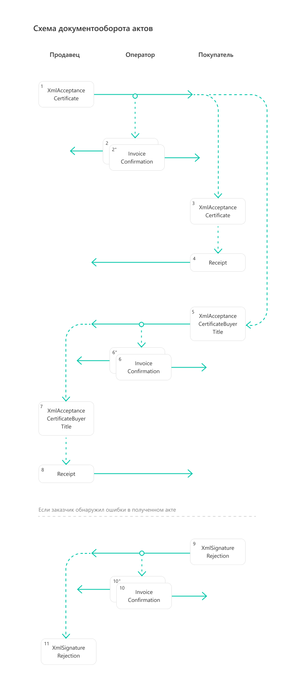

Документооборот актов
=====================

Форматы
-------

.. note:: Подробнее про электронные акты можно прочитать на сайте Диадока:

	- `акт о выполнении работ/оказании услуг <https://www.diadoc.ru/docs/forms/first-documents/Act>`__,
	- `акт об установленном расхождении ТОРГ-2 <https://www.diadoc.ru/docs/forms/44614-torg_2>`__,
	- `акт сверки <https://www.diadoc.ru/docs/forms/44623-akt_sverki>`__.

Формат акта о выполнении работ/оказании услуг утвержден приказом `N ММВ-7-10/552@ <https://normativ.kontur.ru/document/last?moduleId=1&documentId=339635>`_. XSD-схемы для генерации титулов электронного акта:

	- :download:`XSD-схема титула исполнителя <../xsd/DP_REZRUISP_1_990_01_05_01_02.xsd>`,
	- :download:`XSD-схема титула заказчика <../xsd/DP_REZRUZAK_1_990_02_05_01_02.xsd>`.

Универсальный передаточный документ можно использовать как первичный документ, подтверждающий совершение хозяйственной операции. Формат УПД утвержден следующими приказами:

	- `№ ММВ-7-15/820@ <https://normativ.kontur.ru/document/last?moduleId=1&documentId=328588>`__ (действует до 01.04.2025),
	- `№ ЕД-7-26/970@ <https://normativ.kontur.ru/document/last?moduleId=1&documentId=464695>`__.

XSD-схемы для генерации титула исполнителя акта о выполнении работ/оказании услуг:

	- :download:`XSD-схема титула продавца УПД (функция ДОП) 820 формата <../xsd/ON_NSCHFDOPPR_1_997_01_05_01_01.xsd>`,
	- :download:`XSD-схема титула продавца УПД (функция ДОП) 970 формата <../xsd/ON_NSCHFDOPPR_1_997_01_05_02_01.xsd>`.

XSD-схемы для генерации титула заказчика акта о выполнении работ/оказании услуг:

	- :download:`XSD-схема титула покупателя УПД (функция ДОП) 820 формата <../xsd/ON_NSCHFDOPPOK_1_997_02_05_01_01.xsd>`,
	- :download:`XSD-схема титула покупателя УПД (функция ДОП) 970 формата <../xsd/ON_NSCHFDOPPOK_1_997_02_05_02_01.xsd>`.

Формат акта об установленном расхождении ТОРГ-2 акта об установленном расхождении ТОРГ-2 утвержден приказом `N ММВ-7-15/423@ <https://normativ.kontur.ru/document/last?moduleId=1&documentId=348230>`_. XSD-схемы для генерации титулов:

	- :download:`XSD-схема титула покупателя <../xsd/DP_PRIRASXPRIN_1_994_01_05_01_01.xsd>`,
	- :download:`XSD-схема титула доп. сведений <../xsd/DP_PRIRASXDOP_1_994_02_05_01_01.xsd>`.

Формат акта о приемке выполненных работ КС-2 утвержден приказом `N ЕД-7-26/691@ <https://normativ.kontur.ru/document/last?moduleId=1&documentId=431929>`_. XSD-схемы для генерации титулов:

	- :download:`XSD-схема титула подрядчика <../xsd/ON_AKTREZRABP_1_971_01_01_00_01.xsd>`,
	- :download:`XSD-схема титула заказчика <../xsd/ON_AKTREZRABZ_1_971_02_01_00_01.xsd>`.

Формат акта сверки взаимных расчетов утвержден приказом `N ЕД-7-26/405@ <https://normativ.kontur.ru/document/last?moduleId=1&documentId=425482>`_. XSD-схемы для генерации титулов:

	- :download:`XSD-схема титула отправителя <../xsd/ON_AKTSVEROTP_1_972_01_05_01_01.xsd>`,
	- :download:`XSD-схема титула получатель <../xsd/ON_AKTSVERPOL_1_972_02_05_01_01.xsd>`.

XSD-схемы титулов актов последней версии форматов можно получить с помощью метода :doc:`../http/GetDocumentTypes`. Метод вернет ссылку на скачивание схемы в поле ``XsdUrl`` структуры :doc:`DocumentTitleV2 <../proto/DocumentTypeDescriptionV2>`.

.. table:: Соответствие формата и версии документа

	+------------------------------------+-----------------------+--------------+------------------------------------------------+
	| Тип документа                      | Формат                | Функция      | Version                                        |
	+====================================+=======================+==============+================================================+
	| XmlAcceptanceCertificate           | приказ №970           | ДОП          | utd970_05_02_01                                |
	+------------------------------------+-----------------------+--------------+------------------------------------------------+
	| XmlAcceptanceCertificate           | приказ №820           | ДОП          | utd820_05_01_02_hyphen                         |
	+------------------------------------+-----------------------+--------------+------------------------------------------------+
	| XmlAcceptanceCertificate           | приказ №155 (устарел) | ДОП          | utd_05_02_01                                   |
	+------------------------------------+-----------------------+--------------+------------------------------------------------+
	| XmlAcceptanceCertificate           | приказ №552           |              | rezru_05_02_01                                 |
	+------------------------------------+-----------------------+--------------+------------------------------------------------+
	| XmlAcceptanceCertificate           | приказ №172 (устарел) |              | act_05_01_01                                   |
	|                                    |                       |              | act_05_01_02                                   |
	+------------------------------------+-----------------------+--------------+------------------------------------------------+
	| Torg2                              | Приказ №423           |              | torg2_05_01_01                                 |
	+------------------------------------+-----------------------+--------------+------------------------------------------------+
	| PerformedWorkAcceptanceCertificate | Приказ №691           |              | performedworkacceptancecertificate691_01_00_01 |
	+------------------------------------+-----------------------+--------------+------------------------------------------------+
	| ReconciliationAct                  | Приказ №405           |              | reconciliationact405_05_01_01                  |
	+------------------------------------+-----------------------+--------------+------------------------------------------------+

Генерация и парсинг
-------------------

Сгенерировать титулы актов можно с помощью метода :doc:`../http/GenerateTitleXml`. Распарсить документы можно с помощью метода :doc:`../http/ParseTitleXml`.
Генерация актов о приемке выполненных работ КС-2 в АПИ Диадока недоступна.

Версия документа ``documentVersion``, передаваемая в запросе, зависит от формата.

.. table:: Соответствие формата актов и версии документа

	+-------------+-----------------------------------------------------+
	| Формат      | DocumentVersion                                     |
	+=============+=====================================================+
	| Приказ №970 | ``documentVersion = utd970_05_02_01``               |
	+-------------+-----------------------------------------------------+
	| Приказ №820 | ``documentVersion = utd820_05_01_02_hyphen``        |
	+-------------+-----------------------------------------------------+
	| Приказ №552 | ``documentVersion = rezru_05_01_02``                |
	+-------------+-----------------------------------------------------+
	| Приказ №423 | ``documentVersion = torg2_05_01_01``                |
	+-------------+-----------------------------------------------------+
	| Приказ №405 | ``documentVersion = reconciliationact405_05_01_01`` |
	+-------------+-----------------------------------------------------+

Подписант
---------

Форматы актов подразумевают расширенный набор полей для подписантов. Эти поля не содержатся в сертификате или в данных организации.

Если необходимых для подписания данных нет, то будет возникать ошибка.

Заполнение данных подписанта зависит от формата документа:

	- для форматов №552, №423 и №820 — с помощью метода :doc:`../http/ExtendedSignerDetailsV2`,
	- для формата №970, №405 и №691 — с помощью упрощенного XML-файла подписанта.

Добавить в XML-файл титула информацию о подписанте можно с помощью метода :doc:`../http/PrepareDocumentsToSign`. Подробная информация о типах и данных подписантов описана в разделе :doc:`../instructions/preparetosign`.

Порядок обмена
--------------

.. note:: Порядок обмена электронными актами между компаниями через Диадок описан в `инструкции <https://wiki.diadoc.ru/pages/viewpage.action?pageId=1147084>`__.

Порядок обмена электронными актами соответствует порядку обмена двухтитульного электронного документа.

Приведенная ниже схема демонстрирует реализованный в Диадоке порядок обмена актами на примере акта о выполнении работ/оказании услуг.

#. Исполнитель формирует титул исполнителя акта *XmlAcceptanceCertificate*\ :sub:`1`\,  подписывает его и направляет Заказчику.

#. Диадок формирует подтверждение оператора *InvoiceConfirmation*\ :sub:`2`\  о дате получения титула акта, подписывает его и направляет Исполнителю.

#. Диадок формирует подтверждение оператора *InvoiceConfirmation*\ :sub:`2'`\  о дате отправки титула, подписывает его и направляет вместе с титулом исполнителя акта Заказчику.

#. Заказчик получает титул исполнителя акта *XmlAcceptanceCertificate*\ :sub:`3`\  и при необходимости отправляет в ответ подписанное извещение о получении *Receipt* \ :sub:`4`\.

#. Заказчик формирует в ответ титул заказчика акта *XmlAcceptanceCertificateBuyerTitle*\ :sub:`5`\,  подписывает его и отправляет в сторону Исполнителя.

#. Диадок формирует подтверждение оператора *InvoiceConfirmation*\ :sub:`6`\  о дате получения титула заказчика акта, подписывает его и направляет Заказчику.

#. Диадок формирует подтверждение оператора *InvoiceConfirmation*\ :sub:`6'`\  о дате отправки титула заказчика акта, подписывает его и направляет вместе Исполнителю.

#. Исполнитель получает титул заказчика акта и при необходимости отправляет в ответ подписанное извещение о получении *Receipt*\ :sub:`8`\.

#. Если Заказчик обнаружил ошибки в полученном титуле исполнителя акта, он формирует отказ в подписи *XmlSignatureRejection*\ :sub:`9`\,  подписывает его и направляет Исполнителю.

#. Диадок формирует подтверждение оператора *InvoiceConfirmation*\ :sub:`10`\  о дате получения отказа в подписи подписывает его и направляет Исполнителю.

#. Диадок формирует подтверждение оператора *InvoiceConfirmation*\ :sub:`10'`\  о дате отправки отказа в подписи подписывает его и направляет вместе с отказом в подписи *XmlSignatureRejection*\ :sub:`11`\  Заказчику.

Старый порядок обмена
---------------------

.. collapse:: Подробнее

	Схема, приведенная ниже, демонстрирует порядок обмена электронными актами, реализованный в Диадоке:

	#.  Исполнитель формирует титул исполнителя акта *XmlAcceptanceCertificate*\ :sub:`1`\, подписывает его и направляет Заказчику.

	#.  Диадок доставляет титул исполнителя акта *XmlAcceptanceCertificate*\ :sub:`2`\ до Заказчика.

	#.  Заказчик получает титул исполнителя акта *XmlAcceptanceCertificate*\ :sub:`2`\, и формирует в ответ титул заказчика акта *XmlAcceptanceCertificateBuyerTitle*\ :sub:`3`\, подписывает его и отправляет в сторону Исполнителя.

	#.  Диадок доставляет титул заказчика акта *XmlAcceptanceCertificateBuyerTitle*\ :sub:`4`\ до Исполнителя.

	#.  Если Заказчик обнаружил ошибки в полученном титуле исполнителя акта, он формирует отказ в подписи *XmlSignatureRejection*\ :sub:`5`\, подписывает его и направляет Исполнителя.

	#.  Диадок доставляет отказ в подписи *XmlSignatureRejection*\ :sub:`5`\ до Исполнителя.

	.. image:: ../_static/img/docflows/scheme-03-akt-docflow.png
		:align: center