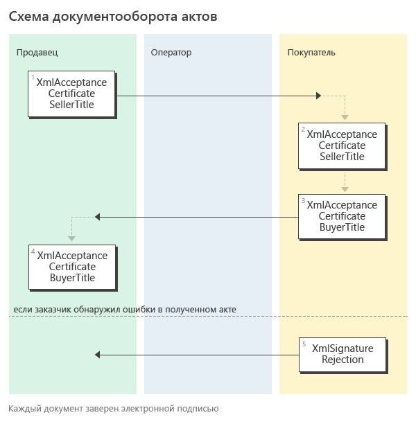

Документооборот актов
=====================

Форматы
-------

.. note::
    Подробнее про электронные акты можно прочитать `здесь <https://www.diadoc.ru/docs/forms/first-documents/Act>`__

Процесс обмена электронными актами в Диадоке реализован с учетом:

- `приказа ФНС РФ от 19.12.2018 N ММВ-7-15/820@ <https://www.diadoc.ru/docs/laws/mmb-7-15-820>`__,

- `приказа ФНС от 30 ноября 2015 г. N ММВ-7-10/552@ <https://www.diadoc.ru/docs/laws/mmb-7-10-552>`__,

- `приказа ФНС РФ от 24.03.2016 N ММВ-7-15/155@ <https://www.diadoc.ru/docs/laws/mmb-7-15-155>`__ (формат устарел),

- `приказа ФНС России от 21.03.2012 № ММВ-7-6/172@ <https://www.diadoc.ru/docs/laws/prikaz-MMB-7-6-172>`__ (формат устарел),

В силу приказа `N ММВ-7-15/820@ <https://normativ.kontur.ru/document?moduleId=1&documentId=328588>`__ утвержден электронный формат универсального передаточного документа УПД. Его можно использовать как первичный документ, подтверждающий совершение хозяйственной операции.

-  :download:`XSD-схема формата титула продавца УПД (функция ДОП) <../xsd/ON_NSCHFDOPPR_1_997_01_05_01_01.xsd>`;

    -  используется для титула исполнителя электронного акта,

-  :download:`XSD-схема формата титула покупателя УПД (функция ДОП) <../xsd/ON_NSCHFDOPPOK_1_997_02_05_01_01.xsd>`;

    -  используется для титула заказчика электронного акта.

В силу приказов `N ММВ-7-10/552@ <https://normativ.kontur.ru/document?moduleId=1&documentId=265283&cwi=136>`__ электронный акт может быть в следующем формате (documentVerstion=rezru_05_01_02):

-  :download:`XSD-схема титула исполнителя электронного акта <../xsd/DP_REZRUISP_1_990_01_05_01_02.xsd>`;

-  :download:`XSD-схема титула заказчика электронного акта <../xsd/DP_REZRUZAK_1_990_02_05_01_02.xsd>`.

XSD-схемы  первого и второго титулов акта последней версии формата 552 могут быть получены с помощью ссылки, доступной в поле *XsdUrl* контракта :doc:`DocumentTitle <../proto/DocumentTypeDescription>`, в результате вызова метода :doc:`../http/GetDocumentTypes`.

.. csv-table:: Соответствие формата накладных и AttachmentVersion
   :header: "Структура", "Форматы", "Функция", "AttachmentVersion"
   :widths: 10, 10, 10, 10

   "XmlAcceptanceCertificate", "- приказ №820", "- ДОП", "-  utd820_05_01_02_hyphen"
   "XmlAcceptanceCertificate", "- приказ №155 (формат устарел)", "- ДОП", "- utd_05_02_01" 
   "XmlAcceptanceCertificate", "- приказ №552", "- –", "- rezru_05_02_01"
   "XmlAcceptanceCertificate", "- приказ №172 (формат устарел)", "- –", "- act_05_01_01
   - act_05_01_02"

Структуры
---------

Для документов, возникающих в ходе документооборота электронных актов, в Диадоке зарезервированы специальные :doc:`типы сущностей <../proto/Entity message>`.

Для титула исполнителя электронного акта можно использовать следующую структуру:

-  *Attachment/XmlAcceptanceCertificate*,

Для титула покупателя электронной накладной можно использовать следующую структуру:

-  *Attachment/XmlAcceptanceCertificateBuyerTitle*,

Генерация
---------

.. csv-table:: Соответствие формата актов и AttachmentVersion
   :header: "Титул", "Формат", "Геренация", "DocumentVersion"
   :widths: 10, 10, 10, 10

   "Титул исполнителя", "Приказ №820", ":doc:`../http/GenerateTitleXml`", "``documentVersion = utd820_05_01_02_hyphen``"
   "Титул заказчика", "Приказ №820", ":doc:`../http/GenerateTitleXml`", "``documentVersion = utd820_05_01_02_hyphen``"
   "Титул исполнителя", "Приказ №552", ":doc:`../http/GenerateTitleXml`", "``documentVersion = rezru_05_01_02``"
   "Титул заказчика", "Приказ №552", ":doc:`../http/GenerateTitleXml`", "``documentVersion = rezru_05_01_02``"
   
Парсинг
-------

.. csv-table:: Соответствие формата накладных и AttachmentVersion
   :header: "Титул", "Формат", "Парсинг", "DocumentVersion"
   :widths: 10, 10, 10, 10

   "Титул исполнителя", "Приказ №820", ":doc:`../http/ParseTitleXml`", "``documentVersion = utd820_05_01_02_hyphen``"
   "Титул заказчика", "Приказ №820", ":doc:`../http/ParseTitleXml`", "``documentVersion = utd820_05_01_02_hyphen``"
   "Титул исполнителя", "Приказ №552", ":doc:`../http/ParseTitleXml`", "``documentVersion = rezru_05_01_02``"
   "Титул заказчика", "Приказ №552", ":doc:`../http/ParseTitleXml`", "``documentVersion = rezru_05_01_02``"

Подписант
---------

Акты в форматах №820, №552 подразумевают расширенный набор полей для подписантов. Этот набор полей не содержится ни в сертификате, ни в данных организации.

Автоматическое заполнение происходит, если в Диадоке есть дополнительные данные, необходимые для подписания. Если дополнительных данных, необходимых для подписания в Диадоке нет, то будет возникать ошибка.

Расширенные данные можно заполнить методом :doc:`../http/utd/ExtendedSignerDetailsV2`.

Порядок обмена
--------------

.. note::
    Порядок обмена электронными актами между компаниями через Диадок описан `здесь <https://wiki.diadoc.ru/pages/viewpage.action?pageId=1147084>`__

Схема, приведенная ниже, демонстрирует порядок обмена электронными актами, реализованный в Диадоке:

#.  Исполнитель формирует титул исполнителя акта *XmlAcceptanceCertificate*\ :sub:`1`\, подписывает его и направляет Заказчику.

#.  Диадок доставляет титул исполнителя акта *XmlAcceptanceCertificate*\ :sub:`2`\ до Заказчика.

#.  Заказчик получает титул исполнителя акта *XmlAcceptanceCertificate*\ :sub:`2`\, и формирует в ответ титул заказчика акта *XmlAcceptanceCertificateBuyerTitle*\ :sub:`3`\, подписывает его и отправляет в сторону Исполнителя.

#.  Диадок доставляет титул заказчика акта *XmlAcceptanceCertificateBuyerTitle*\ :sub:`4`\ до Исполнителя.

#.  Если Заказчик обнаружил ошибки в полученном титуле исполнителя акта, он формирует отказ в подписи *XmlSignatureRejection*\ :sub:`5`\, подписывает его и направляет Исполнителя.

#.  Диадок доставляет отказ в подписи *XmlSignatureRejection*\ :sub:`5`\ до Исполнителя.

