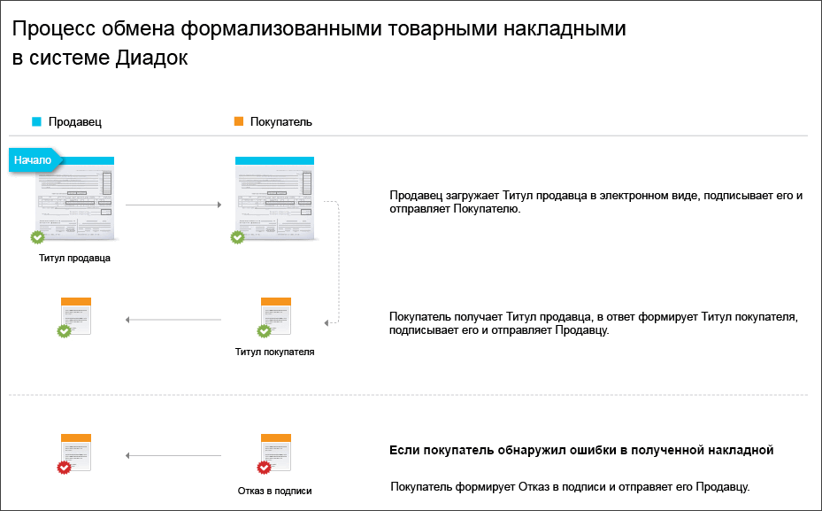

.. _akt-docflow:

Документооборот актов
=====================

Процесс обмена электронными актами в Диадоке реализован с учетом `Приказа ФНС России от 21 марта 2012 № ММВ-7-6/172@ <https://normativ.kontur.ru/document?moduleId=1&documentId=261859>`__.

Акт содержит:

-  Титул исполнителя - сведения об исполнителе, информация о выполненных работках и подпись исполнителя.

-  Титул заказчика - сведения о заказчике и подпись заказчика.

|image0|

С точки зрения исполнителя и заказчика документооборот актами выглядит так:

-  Исполнитель:

    1. Отправляет сформированный акт покупателю и Титул исполнителя, который формируется автоматически.
    2. Получает Титул заказчика о получении акта от заказчика. Документооборот завершен.

-  Заказчик:

    1. Получает акт от исполнителя и Титул исполнителя.
    2. Формирует и отправляет Титул заказчика исполнителю. Документооборот завершен.

|image1|

