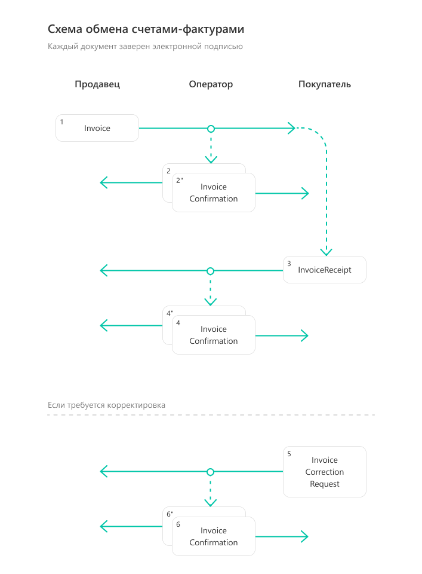
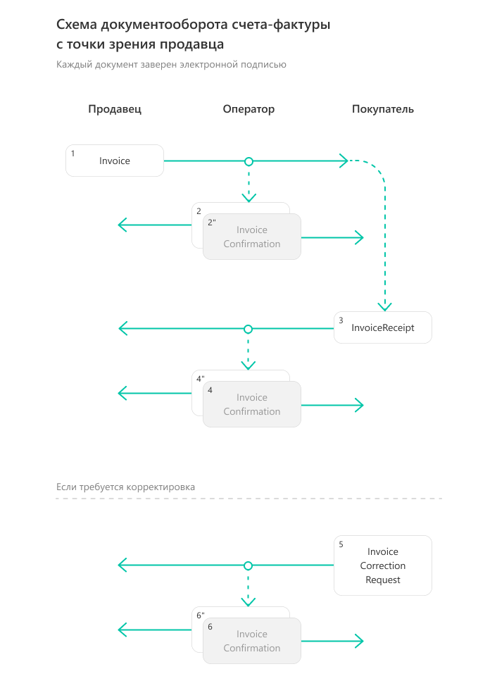
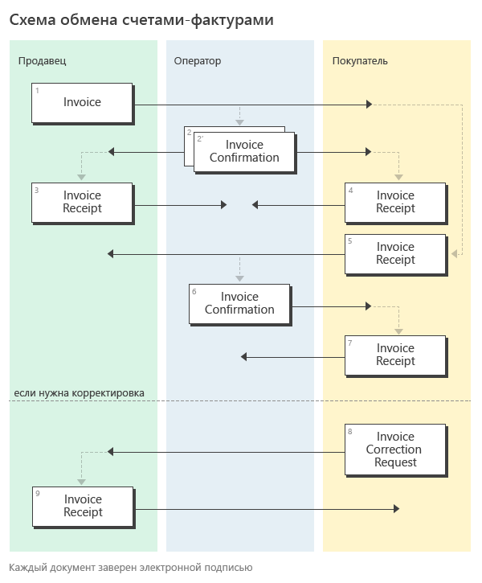
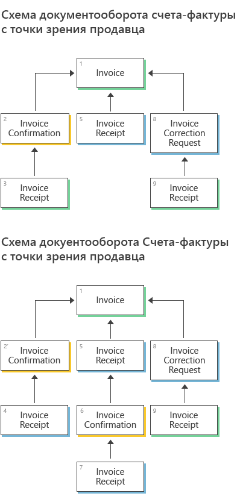
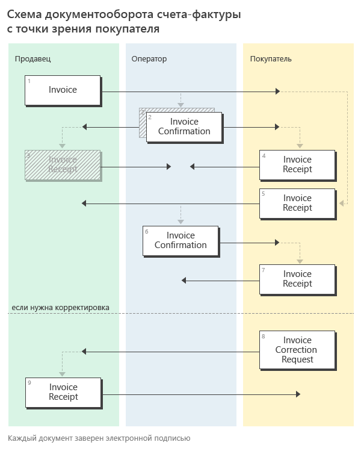
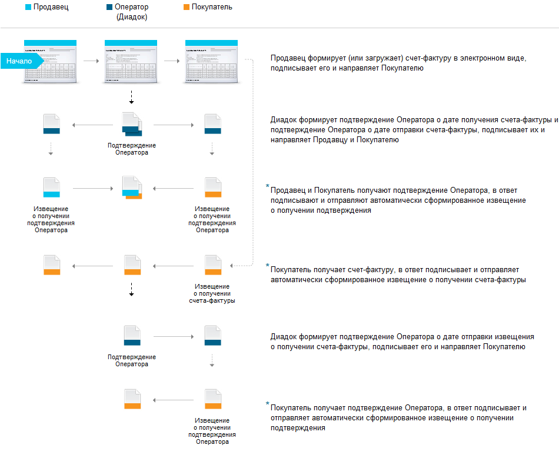

Документооборот счетов-фактур
=============================

Обмен электронными счетами-фактурами в России регулируется Министерством финансов РФ и Федеральной налоговой службой.

Порядок документооборота, связанного с выставлением и получением счетов-фактур в электронном виде с ЭП, утвержден приказом Минфина `от 05.02.2021 N 14Н <https://normativ.kontur.ru/document?moduleId=1&documentId=385831>`__. До 01.07.2021 действовал порядок обмена счетов-фактур, определенный приказом Минфина `от 10.11.2015 N 174Н <https://normativ.kontur.ru/document?moduleId=1&documentId=268278>`__.

.. note::
    Порядок обмена электронными счетами-фактурами между компаниями через интернет описан `здесь <http://www.diadoc.ru/docs/e-invoice/interchange>`__

Форматы
-------

Электронные счета-фактуры можно создавать по формату, утвержденному приказом ФНС России `от 19.12.2018 N ММВ-7-15/820@ <https://normativ.kontur.ru/document?moduleId=1&documentId=328588>`__.

Корректировочные счета-фактуры можно создавать по форматам, утвержденным приказами ФНС России `от 12.10.2020 N ЕД-7-26/736@ <https://normativ.kontur.ru/document?moduleId=1&documentId=375857>`_, `от 13.04.2016 N ММВ-7-15/189@ <https://normativ.kontur.ru/document?moduleId=1&documentId=339567>`_ (действовал до 01.10.2021).

Форматы служебных документов, используемых при выставлении и получении счетов-фактур в электронном виде, утверждены приказом ФНС России `от 30.01.2012 N ММВ-7-6/36@ <https://normativ.kontur.ru/document?moduleId=1&documentId=200672>`__.

XSD-схемы счетов-фактур формата 820, корректировочных счетов-фактур форматов 189 и 736 могут быть получены с помощью ссылки, доступной в поле *XsdUrl* контракта :doc:`DocumentTitle <../proto/DocumentTypeDescription>`, в результате вызова метода :doc:`GetDocumentTypes <../http/GetDocumentTypes>`.

Для СФ и КСФ форматы электронных документов, возникающих в ходе реализации порядка обмена ЭСФ, описываются следующими XSD-схемами:

-  :download:`XSD-схема извещения о получении документа <../xsd/DP_IZVPOL_1_982_00_01_01_02.xsd>`;

-  :download:`XSD-схема подтверждения оператора о дате отправки СФ/ИСФ/КСФ/ИКСФ <../xsd/DP_PDPOL_1_984_00_01_01_02.xsd>` (выдается Продавцу);

-  :download:`XSD-схема подтверждения оператора о дате доставки СФ/ИСФ/КСФ/ИКСФ <../xsd/DP_PDOTPR_1_983_00_01_01_02.xsd>` (выдается Покупателю);

-  :download:`XSD-схема уведомления об уточнении СФ/ИСФ/КСФ/ИКСФ <../xsd/DP_UVUTOCH_1_985_00_01_02_02.xsd>` (формируется Покупателем).

Структуры
---------

Для документов, возникающих в ходе документооборота счетов-фактур, в Диадоке зарезервированы специальные :doc:`типы сущностей <../proto/Entity message>`:

- для счета-фактуры (СФ) - *Attachment/Invoice*,

- для исправления СФ (ИСФ) - *Attachment/InvoiceRevision*,

- для корректировки СФ (КСФ) *Attachment/InvoiceCorrection*,

- для исправления корректировки СФ (ИКСФ) - *Attachment/InvoiceCorrectionRevision*.

Для служебных документов, возникающих в ходе реализации порядка обмена ЭСФ:

-  *Attachment/InvoiceConfirmation* (подтверждение оператора электронного документооборота на СФ/ИСФ/КСФ/ИКСФ, на извещение о получении СФ/ИСФ/КСФ/ИКСФ, на уведомление об уточнении СФ/ИСФ/КСФ/ИКСФ),

-  *Attachment/InvoiceCorrectionRequest* (уведомление об уточнении СФ/ИСФ/КСФ/ИКСФ),

-  *Attachment/InvoiceReceipt* (извещение о получении СФ/ИСФ/КСФ/ИКСФ, подтверждения оператора электронного документооборота, уведомления об уточнении СФ/ИСФ/КСФ/ИКСФ).

.. note::
    Набор служебных документов отличается в порядке согласно приказам `N 14Н <https://normativ.kontur.ru/document?moduleId=1&documentId=385831>`_ и `N 174Н <https://normativ.kontur.ru/document?moduleId=1&documentId=268278>`_. Подробнее см. в разделе Порядок обмена

Порядок обмена
--------------

Счет-фактура и все множество служебных документов, предусмотренных порядком Минфина, помещаются в Диадоке в одно :doc:`сообщение <../proto/Message>` (в одну цепочку документооборота).

Добавление служебных документов к счету-фактуре по мере прохождения им различных этапов документооборота производится при помощи описанного механизма дополнений (см. описание :doc:`модели данных <../DataModel>`).

Передача исправлений СФ, а также корректировочных СФ и исправлений КСФ с точки зрения API Диадока производится точно также, как и передача СФ.

Порядок обмена согласно приказу 14Н
~~~~~~~~~~~~~~~~~~~~~~~~~~~~~~~~~~~~

Схема, приведенная ниже, демонстрирует порядок обмена счетами-фактурами, утвержденный приказом Минфина от `05.02.2021 N 14Н <https://normativ.kontur.ru/document?moduleId=1&documentId=385831>`_ и реализованный в Диадоке:

#.  Продавец формирует счет-фактуру *Invoice*\ :sub:`1`\, подписывает его и направляет Покупателю.

#.  Диадок формирует подтверждение оператора *InvoiceConfirmation*\ :sub:`2`\  о дате получения счета-фактуры, подписывает его и направляет Продавцу.

#.  Диадок формирует подтверждение оператора *InvoiceConfirmation*\ :sub:`2'`\  о дате отправки счета-фактуры, подписывает его и направляет вместе со счетом фактурой Покупателю.

#.  Покупатель получает счет-фактуру и подтверждение оператора и отправляет в ответ подписанное извещение *InvoiceReceipt*\ :sub:`3`\ о получении счета-фактуры.

#.  Диадок формирует подтверждение оператора *InvoiceConfirmation*\ :sub:`4`\  о дате получения извещения о получении счета-фактуры, подписывает его и направляет Покупателю.

#.  Диадок формирует подтверждение оператора *InvoiceConfirmation*\ :sub:`4'`\  о дате отправки извещения о получении счета-фактуры, подписывает его и направляет вместе с извещением о получении Продавцу.

#.  Если Покупатель обнаружил ошибки в полученном счете-фактуре, он формирует уведомление об уточнении счета-фактуры *InvoiceCorrectionRequest*\ :sub:`5`\, подписывает его и направляет Продавцу.

#.  Диадок формирует подтверждение оператора *InvoiceConfirmation*\ :sub:`6`\  о дате получения уведомления об уточнении счета-фактуры, подписывает его и направляет Покупателю.

#.  Диадок формирует подтверждение оператора *InvoiceConfirmation*\ :sub:`6'`\  о дате отправки уведомления об уточнении счета-фактуры, подписывает его и направляет вместе с уведомлением об уточнении счета-фактуры Продавцу.

На схемах ниже изображены структуры Диадок-сообщений в ящиках Продавца и Покупателя, представляющих один и тот же полностью завершенный документооборот (со всеми возможными служебными документами):

.. image:: ../_static/img/docflows/scheme-14n-invoice-buyer-docflow.png
	:align: center

Сущности - документы, относящиеся к документообороту одного счета-фактуры, в рамках Диадок-сообщения связываются между собой при помощи атрибутов *ParentEntityId*.

Например, у сущности *InvoiceConfirmation*\ :sub:`2`\  поле *ParentEntityId* будет указывать на сущность *Invoice*\ :sub:`1`\.

Также у сущности *InvoiceCorrectionRequest*\ :sub:`5`\  поле *ParentEntityId* будет указывать на сущность *Invoice*\ :sub:`1`\.

Если же мы рассмотрим сущности *InvoiceConfirmation*\ :sub:`4`\  и *InvoiceConfirmation*\ :sub:`4'`\, представляющие подтверждение оператора, отправленные Покупателю и Продавцу в ответ на извещение о получении счета-фактуры Покупателем, то у них поле *ParentEntityId* будет указывать на сущность *InvoiceReceipt*\ :sub:`3`\, представляющую это извещение.

На схеме стрелками обозначаются связи типа *ParentEntityId* между сущностями. Сущности типа *Signature*, представляющие ЭП под документами (в соответствии с порядком Минфина все документы возникающие в ходе документооборота счетов-фактур должны сопровождаться ЭП), на схемах не изображены.

Порядок обмена согласно приказу 174Н
~~~~~~~~~~~~~~~~~~~~~~~~~~~~~~~~~~~~

До 01.07.2021 порядок документооборота счетов-фактур определялся приказом Минфина от `10.11.2015 N 174Н <https://normativ.kontur.ru/document?moduleId=1&documentId=268278>`__.

.. raw:: html

   

   
<a>Подробнее</a>

   
Схема, приведенная ниже, демонстрирует порядок обмена счетами-фактурами согласно приказа 174Н:

#.  Продавец формирует счет-фактуру *Invoice*\ :sub:`1`\, подписывает его и направляет Покупателю.

#.  Диадок формирует подтверждение оператора *InvoiceConfirmation*\ :sub:`2`\  о дате получения счета-фактуры, подписывает его и направляет Продавцу.

#.  Диадок формирует подтверждение оператора *InvoiceConfirmation*\ :sub:`2'`\  о дате отправки счета-фактуры, подписывает его и направляет вместе со счетом фактурой Покупателю.

#.  Продавец получает подтверждение оператора и отправляет в ответ подписанное извещение *InvoiceReceipt*\ :sub:`3`\  о получении подтверждения.

#.  Покупатель получает счет-фактуру и подтверждение оператора и отправляет в ответ подписанные извещение *InvoiceReceipt*\ :sub:`5`\  о получении счета-фактуры и извещение *InvoiceReceipt*\ :sub:`4`\  о получении подтверждения.

#.  Диадок формирует подтверждение оператора *InvoiceConfirmation*\ :sub:`6`\  о дате отправки извещения о получении счета-фактуры, подписывает его и направляет Покупателю.

#.  Покупатель получает подтверждение оператора и отправляет в ответ подписанное извещение *InvoiceReceipt*\ :sub:`7`\  о получении подтверждения.

#.  Если Покупатель обнаружил ошибки в полученном счете-фактуре, он формирует уведомление об уточнении счета-фактуры *InvoiceCorrectionRequest*\ :sub:`8`\, подписывает его и направляет Продавцу.

#.  Продавец получает уведомление об уточнении счета-фактуры, и отправляет в ответ подписанное извещение *InvoiceReceipt*\ :sub:`9`\  о получении уведомления.

На схеме, на зеленом фоне, изображены документы, которые формирует Продавец, на желтом фоне – документы, которые формирует Покупатель, на синем – документы, формируемые Диадоком, в качестве оператора электронного документооборота.

На схемах ниже изображены структуры Диадок-сообщений в ящиках Продавца и Покупателя, представляющих один и тот же полностью завершенный документооборот (со всеми возможными служебными документами):

.. raw:: html

   

Для облегчения процесса формирования корректного XML-файла счета-фактуры Диадок предоставляет API метод :doc:`../http/GenerateTitleXml` для счетов-фактур в формате №820.

Метод позволяет интегратору не погружаться в детали XML-формата счета-фактуры, а передавать в Диадок только необходимые первичные данные в виде упрощенной структуры.

В частности, можно не заполнять все реквизиты продавца и покупателя, достаточно указать идентификаторы их ящиков в Диадоке, и тогда соответствующие реквизиты будут автоматически загружены из справочника организаций Диадока.

Как видно из представленных выше схем, порядок Минфина помимо построения в специальном XML-формате собственно счета-фактуры требует от Продавца и Покупателя умения формировать ряд служебных документов, XML-формат которых также строго определен.

Диадок облегчает работу интеграторов в части формирования таких служебных документов, предоставляя методы API :doc:`../http/GenerateReceiptXml` и :doc:`../http/GenerateInvoiceCorrectionRequestXml`, которые скрывают знание о деталях XML-форматов этих документов.

Кроме того, для удобства работы с документами (в частности, со счетами-фактурами) в Диадоке реализован метод :doc:`../http/GetDocuments`, позволяющий быстро получать списки документов, удовлетворяющих различным условиям отбора.

.. |image0| image:: ../_static/img/diadoc-api-invoice-docflow.png
.. |image1| image:: ../_static/img/diadoc-api-data-model-invoice.png

