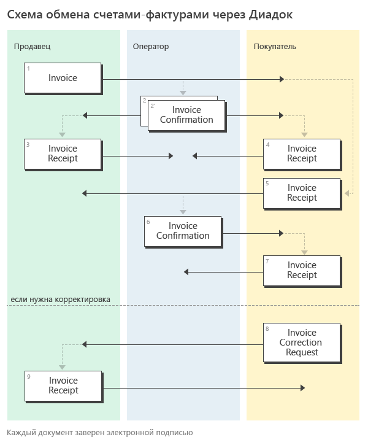

Документооборот счетов-фактур
=============================

Обмен электронными счетами-фактурами в России регулируют Министерство финансов РФ и Федеральная налоговая служба.

Порядок документооборота электронных счетов-фактур (СФ) утвержден `приказом Минфина от 05.02.2021 N 14Н <https://normativ.kontur.ru/document?moduleId=1&documentId=451786>`__. До 01.07.2021 действовал порядок обмена счетов-фактур, утвержденный `приказом Минфина от 10.11.2015 N 174Н <https://normativ.kontur.ru/document?moduleId=1&documentId=268278>`__.

.. note:: Подробнее про счета-фактуры можно прочитать на `сайте Диадока <http://www.diadoc.ru/docs/e-invoice/interchange>`__.

Форматы
-------

Формат электронных счетов-фактур утвержден следующими приказами:

	- `приказ ФНС России от 19.12.2018 N ММВ-7-15/820@ <https://normativ.kontur.ru/document?moduleId=1&documentId=328588>`__ (действует до 01.04.2025),
	- `приказ ФНС РФ от 19.12.2018 № ЕД-7-26/970@ <https://normativ.kontur.ru/document?moduleId=1&documentId=464695>`__.

Формат корректировочных счетов-фактур (КСФ) утвержден `приказом ФНС России от 12.10.2020 N ЕД-7-26/736@ <https://normativ.kontur.ru/document?moduleId=1&documentId=375857>`_. До 1 октября 2021 года действовал `приказ ФНС России от 13.04.2016 N ММВ-7-15/189@ <https://normativ.kontur.ru/document?moduleId=1&documentId=339567>`__.

Получить XSD-схемы счетов-фактур и корректировочных счетов-фактур можно с помощью метода :doc:`../http/GetDocumentTypes`. Метод возвращает ссылку на скачивание схемы в поле ``XsdUrl`` структуры :doc:`DocumentTitle <../proto/DocumentTypeDescription>`.

Форматы служебных документов, используемых при выставлении и получении счетов-фактур в электронном виде, утверждены `приказом ФНС России от 30.01.2012 N ММВ-7-6/36@ <https://normativ.kontur.ru/document?moduleId=1&documentId=200672>`__.

	- :download:`XSD-схема извещения о получении документа <../xsd/DP_IZVPOL_1_982_00_01_03_01.xsd>`;
	- :download:`XSD-схема подтверждения оператора о дате отправки СФ/ИСФ/КСФ/ИКСФ <../xsd/DP_PDPOL_1_984_00_01_01_02.xsd>` (выдается Продавцу);
	- :download:`XSD-схема подтверждения оператора о дате доставки СФ/ИСФ/КСФ/ИКСФ <../xsd/DP_PDOTPR_1_983_00_01_01_02.xsd>` (выдается Покупателю);
	- :download:`XSD-схема уведомления об уточнении СФ/ИСФ/КСФ/ИКСФ <../xsd/DP_UVUTOCH_1_985_00_01_03_01.xsd>` (формируется Покупателем).

Порядок обмена
--------------

Передача исправлений СФ (ИСФ), а также корректировочных СФ и исправлений КСФ (ИКСФ) с точки зрения API Диадока производится точно также, как и передача СФ.

Для документов, возникающих в ходе документооборота счетов-фактур, в Диадоке зарезервированы :doc:`тип сущности <../proto/Entity message>` ``EntityType = Attachment`` и следующие типы вложения ``AttachmentType``:

	- ``Invoice`` — для счета-фактуры,
	- ``InvoiceRevision`` — для исправления СФ,
	- ``InvoiceCorrection`` — для корректировки СФ,
	- ``InvoiceCorrectionRevision`` — для исправления корректировки СФ, 
	- ``InvoiceConfirmation`` — для подтверждения оператора электронного документооборота на СФ/ИСФ/КСФ/ИКСФ, на извещение о получении СФ/ИСФ/КСФ/ИКСФ, на уведомление об уточнении СФ/ИСФ/КСФ/ИКСФ,
	- ``InvoiceCorrectionRequest`` — дляуведомления об уточнении СФ/ИСФ/КСФ/ИКСФ,
	- ``InvoiceReceipt`` — для извещения о получении СФ/ИСФ/КСФ/ИКСФ, подтверждения оператора электронного документооборота, уведомления об уточнении СФ/ИСФ/КСФ/ИКСФ.

Порядок обмена согласно приказу 14Н
~~~~~~~~~~~~~~~~~~~~~~~~~~~~~~~~~~~~

Приведенная ниже схема демонстрирует порядок обмена счетами-фактурами, реализованный в Диадоке:

#. Продавец формирует счет-фактуру *Invoice*\ :sub:`1`\, подписывает его и направляет Покупателю.

#. Диадок формирует подтверждение оператора *InvoiceConfirmation*\ :sub:`2`\  о дате получения счета-фактуры, подписывает его и направляет Продавцу.

#. Диадок формирует подтверждение оператора *InvoiceConfirmation*\ :sub:`2'`\  о дате отправки счета-фактуры, подписывает его и направляет вместе со счетом фактурой Покупателю.

#. Покупатель получает счет-фактуру и подтверждение оператора и отправляет в ответ подписанное извещение *InvoiceReceipt*\ :sub:`3`\ о получении счета-фактуры.

#. Диадок формирует подтверждение оператора *InvoiceConfirmation*\ :sub:`4`\  о дате получения извещения о получении счета-фактуры, подписывает его и направляет Покупателю.

#. Диадок формирует подтверждение оператора *InvoiceConfirmation*\ :sub:`4'`\  о дате отправки извещения о получении счета-фактуры, подписывает его и направляет вместе с извещением о получении Продавцу.

#. Если Покупатель обнаружил ошибки в полученном счете-фактуре, он формирует уведомление об уточнении счета-фактуры *InvoiceCorrectionRequest*\ :sub:`5`\, подписывает его и направляет Продавцу.

#. Диадок формирует подтверждение оператора *InvoiceConfirmation*\ :sub:`6`\  о дате получения уведомления об уточнении счета-фактуры, подписывает его и направляет Покупателю.

#. Диадок формирует подтверждение оператора *InvoiceConfirmation*\ :sub:`6'`\  о дате отправки уведомления об уточнении счета-фактуры, подписывает его и направляет вместе с уведомлением об уточнении счета-фактуры Продавцу.

.. image:: ../_static/img/docflows/scheme-14n-invoice-docflow.png
	:align: center

На схемах ниже изображены структуры сообщений в ящиках Продавца и Покупателя, представляющих один и тот же полностью завершенный документооборот со всеми возможными служебными документами:

.. image:: ../_static/img/docflows/scheme-14n-invoice-seller-docflow.png
	:align: center

.. image:: ../_static/img/docflows/scheme-14n-invoice-buyer-docflow.png
	:align: center

Документы, относящиеся к документообороту одного счета-фактуры, в рамках сообщения связываются между собой с помощью атрибута ``ParentEntityId``.

Например, у сущностей *InvoiceConfirmation*\ :sub:`2`\  и *InvoiceCorrectionRequest*\ :sub:`5`\  поле ``ParentEntityId`` будет указывать на сущность *Invoice*\ :sub:`1`\.

У сущностей *InvoiceConfirmation*\ :sub:`4`\  и *InvoiceConfirmation*\ :sub:`4'`\, представляющих подтверждение оператора, отправленные Покупателю и Продавцу в ответ на извещение о получении счета-фактуры Покупателем, то у них поле *ParentEntityId* будет указывать на сущность *InvoiceReceipt*\ :sub:`3`\, представляющую это извещение.

На схеме стрелками обозначаются связи типа ``ParentEntityId`` между сущностями. Сущности типа ``Signature``, представляющие ЭП под документами, на схемах не изображены.

Порядок обмена согласно приказу 174Н
~~~~~~~~~~~~~~~~~~~~~~~~~~~~~~~~~~~~

До 01.07.2021 порядок документооборота счетов-фактур определялся приказом Минфина от `10.11.2015 N 174Н <https://normativ.kontur.ru/document?moduleId=1&documentId=268278>`__.

.. raw:: html

   

   
<a>Подробнее</a>

   
Схема, приведенная ниже, демонстрирует порядок обмена счетами-фактурами согласно приказа 174Н:

#.  Продавец формирует счет-фактуру *Invoice*\ :sub:`1`\, подписывает его и направляет Покупателю.

#.  Диадок формирует подтверждение оператора *InvoiceConfirmation*\ :sub:`2`\  о дате получения счета-фактуры, подписывает его и направляет Продавцу.

#.  Диадок формирует подтверждение оператора *InvoiceConfirmation*\ :sub:`2'`\  о дате отправки счета-фактуры, подписывает его и направляет вместе со счетом фактурой Покупателю.

#.  Продавец получает подтверждение оператора и отправляет в ответ подписанное извещение *InvoiceReceipt*\ :sub:`3`\  о получении подтверждения.

#.  Покупатель получает счет-фактуру и подтверждение оператора и отправляет в ответ подписанные извещение *InvoiceReceipt*\ :sub:`5`\  о получении счета-фактуры и извещение *InvoiceReceipt*\ :sub:`4`\  о получении подтверждения.

#.  Диадок формирует подтверждение оператора *InvoiceConfirmation*\ :sub:`6`\  о дате отправки извещения о получении счета-фактуры, подписывает его и направляет Покупателю.

#.  Покупатель получает подтверждение оператора и отправляет в ответ подписанное извещение *InvoiceReceipt*\ :sub:`7`\  о получении подтверждения.

#.  Если Покупатель обнаружил ошибки в полученном счете-фактуре, он формирует уведомление об уточнении счета-фактуры *InvoiceCorrectionRequest*\ :sub:`8`\, подписывает его и направляет Продавцу.

#.  Продавец получает уведомление об уточнении счета-фактуры, и отправляет в ответ подписанное извещение *InvoiceReceipt*\ :sub:`9`\  о получении уведомления.

На схеме, на зеленом фоне, изображены документы, которые формирует Продавец, на желтом фоне – документы, которые формирует Покупатель, на синем – документы, формируемые Диадоком, в качестве оператора электронного документооборота.

На схемах ниже изображены структуры Диадок-сообщений в ящиках Продавца и Покупателя, представляющих один и тот же полностью завершенный документооборот (со всеми возможными служебными документами):

.. image:: ../_static/img/docflows/scheme-07-invoice-docflow-2.png
	:align: center

.. image:: ../_static/img/docflows/scheme-08-invoice-docflow-3.png
	:align: center

.. raw:: html

   

.. |image0| image:: ../_static/img/diadoc-api-invoice-docflow.png
.. |image1| image:: ../_static/img/diadoc-api-data-model-invoice.png
.. |image2| image:: ../_static/img/docflows/invoice.jpg
