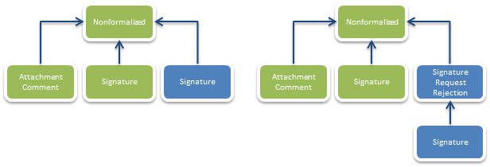

Неформализованный документооборот
=================================

Диадок позволяет передавать любые электронные документы между контрагентами, придавая им юридическую значимость при помощи ЭП. В самом простом случае автор документа должен отправить адресату Диадок-сообщение, поместив в него сам документ в виде сущности типа :doc:`DocumentAttachment <../proto/DocumentAttachment>` и ЭП под документом в виде сущности типа Signature. Кроме того, документ можно сопроводить текстовым комментарием (уже без ЭП), который в Диадоке будет представлен сущностью типа DocumentAttachment/Comment:

|image0|

Стоит также отметить, что в одном сообщении может быть передано сразу несколько документов. На схеме изображена структура Диадок-сообщения, представляющего неформализованный документооборот с одним документом, снабженным комментарием. Стрелками обозначаются связи типа ParentEntityId между сущностями.

Часто возникает необходимость получить под одним документом подписи обоих контрагентов – и отправителя, и получателя. Например, это касается договоров и актов о выполнении работ (оказании услуг). Для поддержки этого сценария в Диадоке реализована возможность при отправке документа запросить под ним подпись получателя.

Получив таким образом помеченный документ, получатель может согласиться с его содержимым и поставить под ним свою подпись, «пропатчив» соответствующее Диадок-сообщение добавлением к нему сущности типа Signature, представляющей ЭП получателя под данным документом.

Или же он может отказаться от формирования ответной подписи, добавив к данному Диадок-сообщению сущность типа :doc:`Attachment/RequestedSignatureRejections <../proto/Entity>`, содержащую текст причины отказа, а также сущность типа Signature, представляющую ЭП под этим текстом.

На схемах ниже изображены структуры Диадок-сообщений, представляющих неформализованный документооборот с ответной подписью под документом и неформализованный документооборот с отказом от запрошенной подписи:

|image1|

Зелеными прямоугольниками на схемах изображены сущности, которые формирует отправитель сообщения, а синими – сущности, которые формирует получатель.

.. |image0| image:: ../_static/img/diadoc-api-data-model-nonformalized.png

