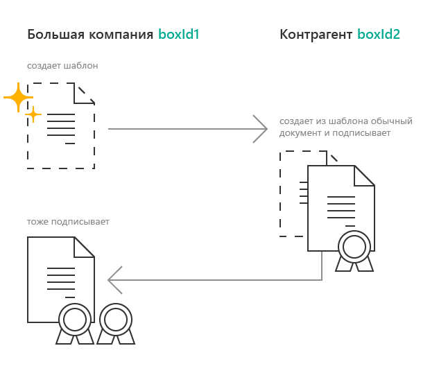
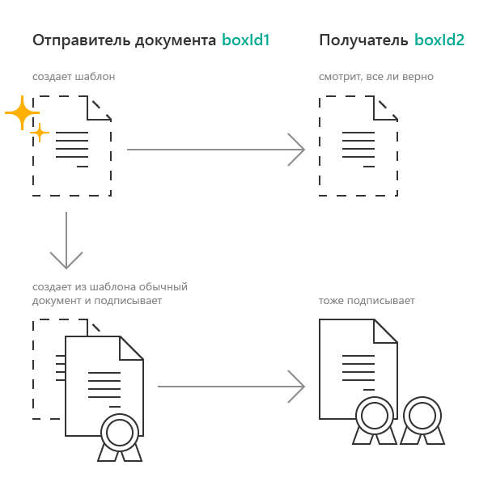
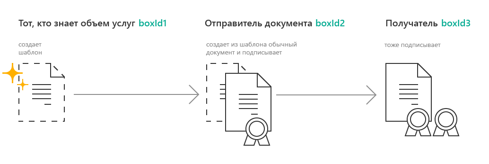

Документооборот шаблонов
========================

Диадок позволяет обмениваться не только юридически значимыми документами, но и документами, отправленными без подписи. Такие документы называются шаблонами. Шаблоны могут быть полезны, если требуется показать контрагенту документ до его подписания.

Из шаблона может быть создан юридически значимый документ. Сторона, которая сможет создать документ из шаблона выбирается в момент отправки шаблона.

Отправка шаблона
----------------

Для отправки шаблона используется метод :doc:`../http/PostTemplate`. Отправка шаблонов возможна только после настройки вашей организации. Для настройки обратитесь к вашему менеджеру или в `техническую поддержку <https://www.diadoc.ru/support>`__.

Варианты документооборота шаблона  и документа, который будет создан из этого шаблона:

1) Схема используется, если организация получатель документа подготавливает документ за отправителя. Организация-получатель шаблона создаёт из него документ, подписывает его и отправляет. Компания, которая отправляла шаблон, получит входящий документ, созданный из шаблона. 

Для того, чтобы отправить документ по такой схеме, идентификаторы ящиков нужно заполнить так:

::

    "FromBoxId": "boxId1",
    "ToBoxId": "boxId2",
    "MessageFromBoxId": "boxId2",
    "MessageToBoxId": "boxId1"

2) Шаблон используется для предварительного просмотра документа будущим получателем. Отправитель шаблона является отправителем документа. Тот, кто получает шаблон, получит и документ.

Для того, чтобы отправить документ по такой схеме, идентификаторы ящиков нужно заполнить так:

::

    "FromBoxId": "boxId1",
    "ToBoxId": "boxId2",
    "MessageFromBoxId": "boxId1",
    "MessageToBoxId": "boxId2"

3) Схема используется, когда документ подготавливает сторона, не участвующая в юридически значимом документообороте. Получатель документа не имеет доступа к шаблону. Шаблон согласовывают между собой две компании, документ получает третья.

Для того, чтобы отправить документ по такой схеме, идентификаторы ящиков нужно заполнить так:
::

    "FromBoxId": "boxId1",
    "ToBoxId": "boxId2",
    "MessageFromBoxId": "boxId2",
    "MessageToBoxId": "boxId3"

Шаблоном можно отправить `все доступные <http://api-docs.diadoc.ru/ru/latest/http/GetDocumentTypes.html>`__ типы документов. 

Формализованные документы в шаблоне можно отправить с незаполненными полями, например, без указания номера документа. В таких документах недостающие поля будут заполняться получателем. Чтобы отправить шаблон, требующий заполнения, при отправке укажите *EditingSettingId*. Для получения идентификатора настройки, обратитесь к вашему менеджеру.

Получение шаблона
-----------------

Получить шаблон по идентификаторам можно с помощью метода :doc:`../http/GetTemplate`.

Получение новостей по шаблону и методы получения списка шаблонов временно недоступны.

Создание документа из шаблона
-----------------------------

Создать документ из шаблона может организация, чей ящик указан в поле Message
FromBoxId. Для создания документа из шаблона, следует вызовите метод :doc:`../http/TransformTemplateToMessage`.
Из одного шаблона можно создать неограниченное количество документов.

Созданный документ можно найти среди исходящих неподписанных документов. Узнать из какого шаблона был создан документ можно с помощью свойства :doc:`../proto/Origin` в структуре :doc:`../proto/Document`.

Если документ был отправлен с настройкой редактирования, то созданный документ необходимо дозаполнить. Для того, что бы заполнить документ, следует отправить `патч <http://api-docs.diadoc.ru/ru/latest/proto/MessagePatchToPost.html>`__ c типом *EditingPatches*. Методы для получения настроек дозаполнения пока недоступны.

Отклонение и отзыв шаблон
-----------------------------
Входящий шаблон можно отклонить с помощью метода :doc:`../http/PostTemplatePatch`. Отклонение можно использовать, если вы не согласны с шаблоном и не готовы формировать и подписывать документ из этого шаблона.

Отклонение шаблона может быть запрещено отправителем шаблона. Для этого при отправке нужно указать признак RefusalDisabled=true в структуре :doc:`../proto/TemplateDocumentAttachment`.

Исходящий шаблон можно отозвать с помощью метода :doc:`../http/PostTemplatePatch`. После отзыва получатель шаблона не сможет создать документ из шаблон, отклонить шаблон и отправить документы, созданные из шаблона до его отзыва.

Дополнительные действия, доступные для шаблонов
-----------------------------------------------
- Отправка в закрытом пакете. Документы, созданные из шаблонов в закрытом пакете, также будут отправлены в пакете, состав которого изменить нельзя.
- `Удаление <http://api-docs.diadoc.ru/ru/latest/http/Delete.html>`__ и `восстановление <http://api-docs.diadoc.ru/ru/latest/http/Restore.html>`__.
- Получение событий по шаблонам :doc:`../http/GetNewEvents`, :doc:`../http/GetDocflows_V3`, :doc:`../http/GetMessage`
- Перемещение шаблонов :doc:`../http/MoveDocuments`

Все остальные действия для шаблонов недоступны.
