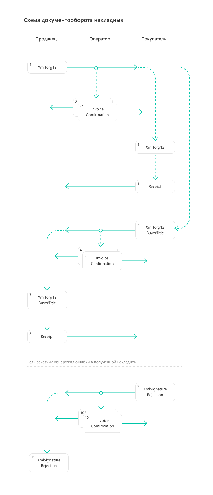

Документооборот накладных
=========================

Форматы
-------

.. note:: Подробнее про электронные накладные можно прочитать на `сайте Диадока <https://www.diadoc.ru/docs/forms/first-documents/nakladnaya>`__. 

Формат товарной накладной утвержден `приказом № ММВ-7-10/551@ <https://normativ.kontur.ru/document?moduleId=1&documentId=339634>`__. XSD-схемы для генерации титулов электронного акта:

	- :download:`XSD-схема титула продавца электронной накладной <../xsd/DP_TOVTORGPR_1_992_01_05_01_04.xsd>`,
	- :download:`XSD-схема титула покупателя электронной накладной <../xsd/DP_TOVTORGPOK_1_992_02_05_01_04.xsd>`.

Универсальный передаточный документ можно использовать как первичный документ, подтверждающий совершение хозяйственной операции. Формат УПД утвержден следующими приказами:

	- `№ ММВ-7-15/820@ <https://normativ.kontur.ru/document?moduleId=1&documentId=328588>`__ (действует до 01.04.2025),
	- `№ ЕД-7-26/970@ <https://normativ.kontur.ru/document?moduleId=1&documentId=464695>`__.

XSD-схемы для генерации титула исполнителя электронного акта:

	- :download:`XSD-схема титула продавца УПД (функция ДОП) 820 формата <../xsd/ON_NSCHFDOPPR_1_997_01_05_01_01.xsd>`,
	- :download:`XSD-схема титула продавца УПД (функция ДОП) 970 формата <../xsd/ON_NSCHFDOPPR_1_997_01_05_02_01.xsd>`.

XSD-схемы для генерации титула заказчика электронного акта:

	- :download:`XSD-схема титула покупателя УПД (функция ДОП) 820 формата <../xsd/ON_NSCHFDOPPOK_1_997_02_05_01_01.xsd>`,
	- :download:`XSD-схема титула продавца УПД (функция ДОП) 970 формата <../xsd/ON_NSCHFDOPPOK_1_997_02_05_02_01.xsd>`.

Получить последние версии XSD-схем для первого и второго титула товарной накладной можно с помощью метода :doc:`../http/GetDocumentTypes`. Метод вернет ссылку на скачивание схемы в поле ``XsdUrl`` структуры :doc:`DocumentTitle <../proto/DocumentTypeDescription>`.

.. table:: Соответствие формата и версии документа

	+---------------+-----------------------+--------------+------------------------+
	| Тип документа | Формат                | Функция      | Version                |
	+===============+=======================+==============+========================+
	| XmlTorg12     | приказ №970           | ДОП          | utd970_05_02_01        |
	+---------------+-----------------------+--------------+------------------------+
	| XmlTorg12     | приказ №820           | ДОП          | utd820_05_01_02_hyphen |
	+---------------+-----------------------+--------------+------------------------+
	| XmlTorg12     | приказ №155 (устарел) | ДОП          | utd_05_02_01           |
	+---------------+-----------------------+--------------+------------------------+
	| XmlTorg12     | приказ №551           |              | tovtorg_05_02_01       |
	+---------------+-----------------------+--------------+------------------------+
	| XmlTorg12     | приказ №172 (устарел) |              | torg12_05_01_01        |
	|               |                       |              | torg12_05_01_02        |
	+---------------+-----------------------+--------------+------------------------+

Генерация и парсинг
-------------------

Сгенерировать титулы исполнителя и заказчика можно с помощью метода :doc:`../http/GenerateTitleXml`. Распарсить документ можно с помощью метода :doc:`../http/ParseTitleXml`.

Версия документа ``documentVersion``, передаваемая в запросе, зависит от формата.

.. table:: Соответствие формата актов и версии документа

	+-------------+----------------------------------------------+
	| Формат      | DocumentVersion                              |
	+=============+==============================================+
	| Приказ №970 | ``documentVersion = utd970_05_02_01``        |
	+-------------+----------------------------------------------+
	| Приказ №820 | ``documentVersion = utd820_05_01_02_hyphen`` |
	+-------------+----------------------------------------------+
	| Приказ №552 | ``documentVersion = tovtorg_05_01_04``       |
	+-------------+----------------------------------------------+

Подписант
---------

Форматы накладных подразумевают расширенный набор полей для подписантов. Эти поля не содержатся в сертификате или в данных организации.

Если необходимых для подписания данных нет, то будет возникать ошибка.

Расширенные данные можно заполнить с помощью метода :doc:`../http/utd/ExtendedSignerDetailsV2`.

Добавить в XML-файл информацию о подписанте можно с помощью метода :doc:`../http/PrepareDocumentsToSign`. Подробная информация о типах и данных подписантов описана в разделе :ref:`doc_prepare_to_sign`.

Порядок обмена
--------------

.. note:: Порядок обмена электронными накладными между компаниями через Диадок описан в `инструкции <https://wiki.diadoc.ru/pages/viewpage.action?pageId=1147081>`__.

Порядок обмена электронными накладными соответствует порядку обмена двухтитульного электронного документа.

Для документов, возникающих в ходе документооборота электронных накладных, в Диадоке зарезервированы :doc:`тип сущности <../proto/Entity message>` ``EntityType = Attachment`` и следующие типы вложения ``AttachmentType``:

	- ``XmlTorg12`` — для титула продавца электронной накладной,
	- ``XmlTorg12BuyerTitle`` — для титула покупателя электронной накладной,
	- ``XmlSignatureRejection`` — для формализованного отказа в подписи электронной накладной.

Приведенная ниже схема демонстрирует порядок обмена электронными накладными, реализованный в Диадоке:

#. Продавец формирует титул продавца накладной *XmlTorg12*\ :sub:`1`\, подписывает его и направляет Покупателю.

#. Диадок формирует подтверждение оператора *InvoiceConfirmation*\ :sub:`2`\  о дате получения титула продавца накладной, подписывает его и направляет Продавцу.

#. Диадок формирует подтверждение оператора *InvoiceConfirmation*\ :sub:`2'`\  о дате отправки титула продавца накладной, подписывает его и направляет вместе с титулом Покупателю.

#. Диадок доставляет титул продавца накладной *XmlTorg12*\ :sub:`3`\  до Покупателя.

#. Покупатель получает титул продавца накладной *XmlTorg12*\ :sub:`3`\  и при необходимости отправляет в ответ подписанное извещение о получении *Receipt*\ :sub:`4`\.

#. Покупатель формирует в ответ титул покупателя накладной *XmlTorg12BuyerTitle*\ :sub:`5`\, подписывает его и отправляет в сторону Продавца.

#. Диадок формирует подтверждение оператора *InvoiceConfirmation*\ :sub:`6`\  о дате получения титула покупателя накладной, подписывает его и направляет Покупателю.

#. Диадок формирует подтверждение оператора *InvoiceConfirmation*\ :sub:`6'`\  о дате отправки титула покупателя наклодной, подписывает его и направляет Продавцу.

#. Продавец получает титул покупателя накладной и при необходимости отправляет в ответ подписанное извещение о получении *Receipt*\ :sub:`8`\.

#. Если Покупатель обнаружил ошибки в полученном титуле продавца накладной, он формирует отказ в подписи *XmlSignatureRejection*\ :sub:`9`\, подписывает его и направляет Продавцу.

#. Диадок формирует подтверждение оператора *InvoiceConfirmation*\ :sub:`10`\  о дате получения отказа в подписи, подписывает его и направляет Покупателю.

#. Диадок формирует подтверждение оператора *InvoiceConfirmation*\ :sub:`10'`\  о дате отправки отказа в подписи, подписывает его и направляет вместе с отказом в подписи *XmlSignatureRejection*\ :sub:`11`\  Продавцу.

Старый порядок обмена
---------------------

.. raw:: html

   

   
<a>Подробнее</a>

Схема, приведенная ниже, демонстрирует порядок обмена электронными накладными, реализованный в Диадоке:

#.  Продавец формирует титул продавца накладной *XmlTorg12*\ :sub:`1`\, подписывает его и направляет Покупателю.

#.  Диадок доставляет титул продавца накладной *XmlTorg12*\ :sub:`2`\ до Покупателя.

#.  Покупатель получает титул продавца накладной *XmlTorg12*\ :sub:`2`\, и формирует в ответ титул покупателя накладной *XmlTorg12BuyerTitle*\ :sub:`3`\, подписывает его и отправляет в сторону Продавца.

#.  Диадок доставляет титул покупателя накладной *XmlTorg12BuyerTitle*\ :sub:`4`\ до Продавца.

#.  Если Покупатель обнаружил ошибки в полученном титуле продавца накладной, он формирует отказ в подписи *XmlSignatureRejection*\ :sub:`5`\, подписывает его и направляет Продавцу.

#.  Диадок доставляет отказ в подписи *XmlSignatureRejection*\ :sub:`5`\ до Продавца.

.. image:: ../_static/img/docflows/scheme-02-torg12-docflow.png
	:align: center

.. raw:: html

   

   