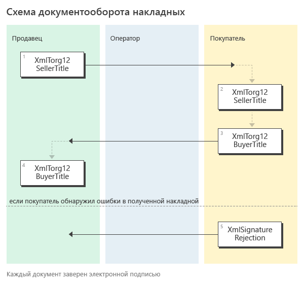

Документооборот накладных
=========================

Форматы
-------

.. note::
    Подробнее про электронные накладные можно прочитать `здесь <https://www.diadoc.ru/docs/forms/first-documents/nakladnaya>`__

Процесс обмена электронными накладными в Диадоке реализован с учетом:

- `приказа ФНС РФ от 19.12.2018 N ММВ-7-15/820@ <https://www.diadoc.ru/docs/laws/mmb-7-15-820>`__,

- `приказа ФНС от 30 ноября 2015 г. N ММВ-7-10/551@ <https://www.diadoc.ru/docs/laws/mmb-7-10-551>`__,

- `приказа ФНС РФ от 24.03.2016 N ММВ-7-15/155@ <https://www.diadoc.ru/docs/laws/mmb-7-15-155>`__ (формат устарел),

- `приказа ФНС России от 21.03.2012 № ММВ-7-6/172@ <https://www.diadoc.ru/docs/laws/prikaz-MMB-7-6-172>`__ (формат устарел),

В силу приказа `N ММВ-7-15/820@ <https://normativ.kontur.ru/document?moduleId=1&documentId=328588>`__ утвержден электронный формат универсального передаточного документа УПД. Его можно использовать как первичный документ, подтверждающий совершение хозяйственной операции.

-  :download:`XSD-схема формата титула продавца УПД (функция ДОП) <../xsd/ON_NSCHFDOPPR_1_997_01_05_01_01.xsd>`;

    -  используется для титула продавца электронной накладной,

-  :download:`XSD-схема формата титула покупателя УПД (функция ДОП) <../xsd/ON_NSCHFDOPPOK_1_997_02_05_01_01.xsd>`;

    -  используется для титула покупателя электронной накладной.

В силу приказа `N ММВ-7-10/551@ <https://normativ.kontur.ru/document?moduleId=1&documentId=265102&cwi=132>`__ электронная товарная накладная может быть в следующем формате (documentVersion=tovtorg_05_01_04) :

  -  :download:`XSD-схема титула продавца электронной накладной <../xsd/DP_TOVTORGPR_1_992_01_05_01_04.xsd>`;

  -  :download:`XSD-схема титула покупателя электронной накладной <../xsd/DP_TOVTORGPOK_1_992_02_05_01_04.xsd>`.
  
  Последние версии xsd-схем для первого и второго титула товарной накладной формата 551 могут быть получены с помощью ссылки, доступной в поле *XsdUrl* контракта :doc:`DocumentTitle <../proto/DocumentTypeDescription>`, в результате вызова метода :doc:`../http/GetDocumentTypes`.

.. csv-table:: Соответствие формата накладных и AttachmentVersion
   :header: "Структура", "Форматы", "Функция", "AttachmentVersion"
   :widths: 10, 10, 10, 10

   "XmlTorg12", "- приказ №820", "- ДОП", "- utd820_05_01_02_hyphen"
   "XmlTorg12", "- приказ №155 (формат устарел)", "- ДОП", "- utd_05_02_01"
   "XmlTorg12", "- приказ №551", "- –", "- tovtorg_05_02_01"
   "XmlTorg12", "- приказ №172 (формат устарел)", "- –", "- torg12_05_01_01;
   - torg12_05_01_02"

Структуры
---------

Для документов, возникающих в ходе документооборота электронных накладных, в Диадоке зарезервированы специальные :doc:`типы сущностей <../proto/Entity message>`.

Для титула продавца электронной накладной можно использовать следующую структуру:

-  *Attachment/XmlTorg12*,

Для титула покупателя электронной накладной можно использовать следующую структуру:

-  *Attachment/XmlTorg12BuyerTitle*,

Для формализованного отказа в подписи электронной накладной в Диадоке используется:

-  *XmlSignatureRejection*

Генерация
---------

.. csv-table:: Соответствие формата накладных и AttachmentVersion
   :header: "Титул", "Формат", "Геренация", "DocumentVersion"
   :widths: 10, 10, 10, 10

   "Титул продавца", "Приказ №820", ":doc:`../http/GenerateTitleXml`", "``documentVersion = utd820_05_01_02_hyphen``"
   "Титул покупателя", "Приказ №820", ":doc:`../http/GenerateTitleXml`", "``documentVersion = utd820_05_01_02_hyphen``"
   "Титул продавца", "Приказ №551", ":doc:`../http/GenerateTitleXml`", "``documentVersion = tovtorg_05_01_04``"
   "Титул покупателя", "Приказ №551", ":doc:`../http/GenerateTitleXml`", "``documentVersion = tovtorg_05_01_04``"
   

Парсинг
-------

.. csv-table:: Соответствие формата накладных и AttachmentVersion
   :header: "Титул", "Формат", "Парсинг", "DocumentVersion"
   :widths: 10, 10, 10, 10

   "Титул продавца", "Приказ №820", ":doc:`../http/ParseTitleXml`", "``documentVersion = utd820_05_01_02_hyphen``"
   "Титул покупателя", "Приказ №820", ":doc:`../http/ParseTitleXml`", "``documentVersion = utd820_05_01_02_hyphen``"
   "Титул продавца", "Приказ №551", ":doc:`../http/ParseTitleXml`", "``documentVersion = tovtorg_05_01_04``"
   "Титул покупателя", "Приказ №551", ":doc:`../http/ParseTitleXml`", "``documentVersion = tovtorg_05_01_04``"
   
Подписант
---------

Накладные в форматах №820 и №551 подразумевают расширенный набор полей для подписантов. Этот набор полей не содержится ни в сертификате, ни в данных организации.

Автоматическое заполнение происходит, если в Диадоке есть дополнительные данные, необходимые для подписания. Если дополнительных данных, необходимых для подписания в Диадоке нет, то будет возникать ошибка.

Расширенные данные можно заполнить методом :doc:`../http/utd/ExtendedSignerDetailsV2`.

Порядок обмена
--------------

.. note::
    Порядок обмена электронными накладными между компаниями через Диадок описан `здесь <https://wiki.diadoc.ru/pages/viewpage.action?pageId=1147081>`__

Схема, приведенная ниже, демонстрирует порядок обмена электронными накладными, реализованный в Диадоке:

#.  Продавец формирует титул продавца накладной *XmlTorg12*\ :sub:`1`\, подписывает его и направляет Покупателю.

#.  Диадок доставляет титул продавца накладной *XmlTorg12*\ :sub:`2`\ до Покупателя.

#.  Покупатель получает титул продавца накладной *XmlTorg12*\ :sub:`2`\, и формирует в ответ титул покупателя накладной *XmlTorg12BuyerTitle*\ :sub:`3`\, подписывает его и отправляет в сторону Продавца.

#.  Диадок доставляет титул покупателя накладной *XmlTorg12BuyerTitle*\ :sub:`4`\ до Продавца.

#.  Если Покупатель обнаружил ошибки в полученном титуле продавца накладной, он формирует отказ в подписи *XmlSignatureRejection*\ :sub:`5`\, подписывает его и направляет Продавцу.

#.  Диадок доставляет отказ в подписи *XmlSignatureRejection*\ :sub:`5`\ до Продавца.

