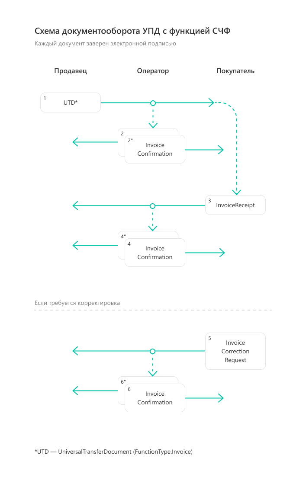
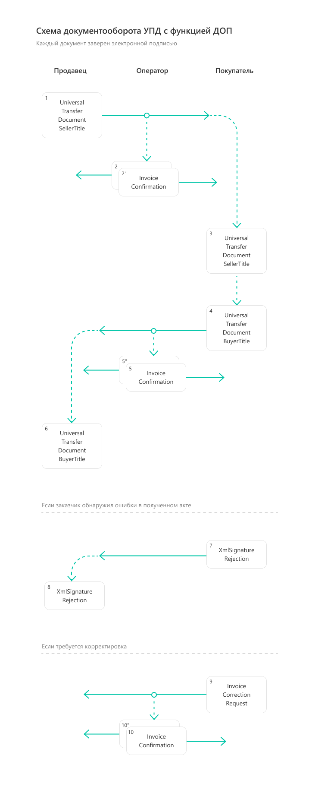
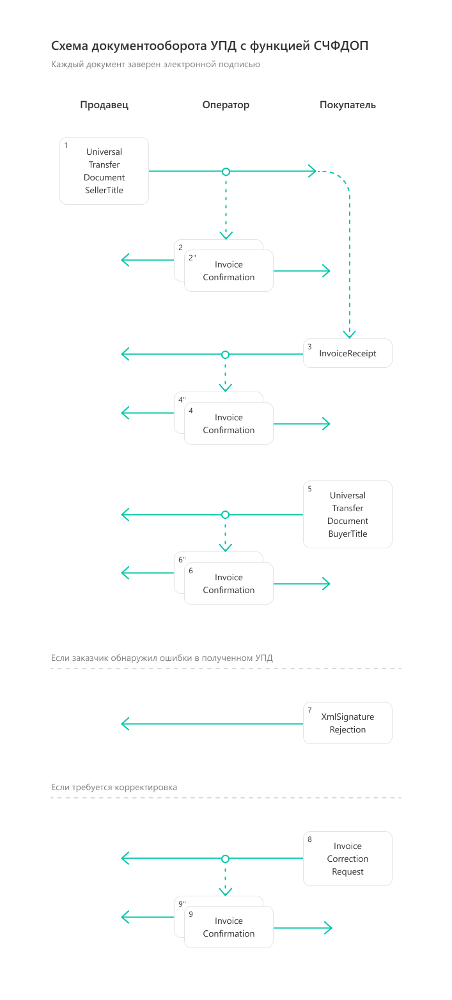
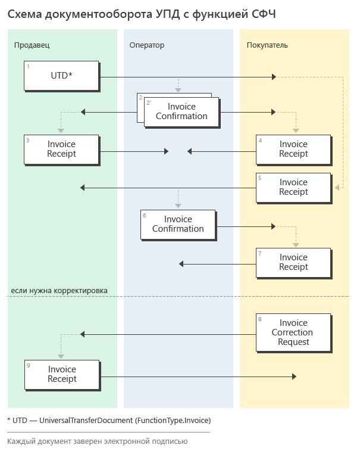
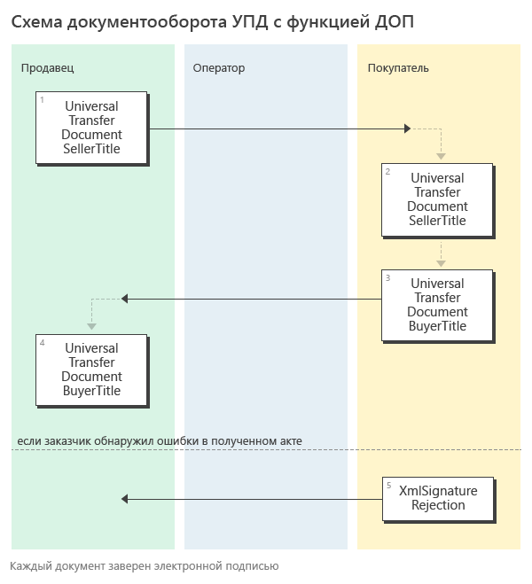
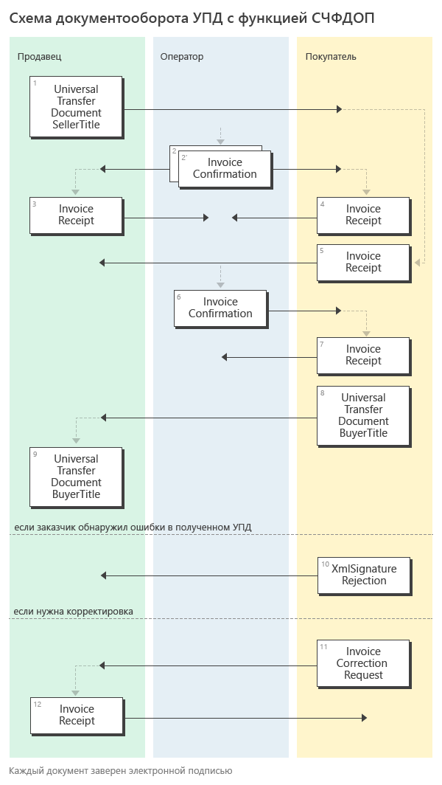

.. _utd-docflow:

Документооборот УПД
===================

Приказом ФНС России от `24.03.2016 №ММВ-7-15/155@ <https://normativ.kontur.ru/document?moduleId=1&documentId=271958>`__ утвержден электронный формат универсального передаточного документа УПД. На смену формату №155 пришел формат №820, утвержденный `Приказом ФНС России от 19.12.2018 №ММВ-7-15/820@ <https://normativ.kontur.ru/document?moduleId=1&documentId=328588>`_

До конца 2019 года действующими являлись оба формата, с 1 января 2020 года формат №155 утратил силу.

.. note::
    Подробнее про УПД можно прочитать `здесь <http://www.diadoc.ru/docs/upd>`__

Формат документа можно использовать:

- как счет-фактуру;

- как первичный документ, подтверждающий совершение хозяйственной операции;

- как универсальный передаточный документ (УПД), который совмещает в себе счет-фактуру и первичный документ, подтверждающий совершение хозяйственной операции.

.. note::
    Форма универсального передаточного документа, а также рекомендации по его заполнению приведены в письме ФНС России `от 21.10.13 № ММВ-20-3/96@ <https://normativ.kontur.ru/document?moduleId=1&documentId=220334>`__.

Форматы
-------

XSD-схемы первого и второго титулов УПД последней версии форматов 820, 155 могут быть получены с помощью ссылки, доступной в поле *XsdUrl* контракта :doc:`DocumentTitle <../proto/DocumentTypeDescription>`, в результате вызова метода :doc:`../http/GetDocumentTypes`.

.. note::
    До конца 2019 года действующими являлись оба формата - №155 и №820, с 1 января 2020 года формат №155 утратил свою силу.

Порядок обмена согласно приказу 14Н
-----------------------------------

УПД с функцией СЧФ
~~~~~~~~~~~~~~~~~~

Структуры
"""""""""

Для документов, возникающих в ходе документооборота УПД с функцией СЧФ, в Диадоке зарезервированы специальные :doc:`типы сущностей <../proto/Entity message>`:

- для УПД с функцией СЧФ - *Attachment/UniversalTransferDocument*,

- для исправления УПД с функцией СЧФ - *Attachment/UniversalTransferDocumentRevision*,

- для корректировки УКД с функцией КСЧФ -  *Attachment/UniversalCorrectionDocument*,

- для исправления корректировки УКД с функцией КСЧФ - *Attachment/UniversalCorrectionDocumentRevision*.

Для служебных документов, возникающих в ходе реализации порядка обмена УПД с функцией СЧФ:

-  *Attachment/InvoiceConfirmation* (подтверждение оператора электронного документооборота на УПД (СЧФ)/иУПД (СЧФ)/УКД (КСЧФ)/иУКД (КСЧФ), на извещение о получении УПД (СЧФ)/иУПД (СЧФ)/УКД (КСЧФ)/иУКД (КСЧФ), на уведомление об уточнении УПД (СЧФ)/иУПД (СЧФ)/УКД (КСЧФ)/иУКД (КСЧФ),

-  *Attachment/InvoiceCorrectionRequest* (уведомление об уточнении УПД (СЧФ)/иУПД (СЧФ)/УКД (КСЧФ)/иУКД (КСЧФ)),

-  *Attachment/InvoiceReceipt* (извещение о получении УПД (СЧФ)/иУПД (СЧФ)/УКД (КСЧФ)/иУКД (КСЧФ)).

Порядок обмена
""""""""""""""

В случае, когда УПД используется с функцией СЧФ, документооборот повторяет :doc:`документооборот СФ <InvoiceDocflow>`.

Порядок документооборота, связанного с выставлением и получением счетов-фактур в электронном виде с ЭП, утвержден приказом Минфина `от 05.02.2021 N 14Н <https://normativ.kontur.ru/document?moduleId=1&documentId=385831>`_.

#.  Продавец формирует УПД (СЧФ) *UniversalTransferDocument*\ :sub:`1`\, подписывает его и направляет Покупателю.

#.  Диадок формирует подтверждение оператора *InvoiceConfirmation*\ :sub:`2`\  о дате получения УПД (СЧФ), подписывает его и направляет Продавцу.

#.  Диадок формирует подтверждение оператора *InvoiceConfirmation*\ :sub:`2'`\  о дате отправки УПД (СЧФ), подписывает его и направляет вместе с УПД (СЧФ) Покупателю.

#.  Покупатель получает УПД (СЧФ) и подтверждение оператора и отправляет в ответ подписанные извещение *InvoiceReceipt*\ :sub:`3`\  о получении УПД (СЧФ).

#.  Диадок формирует подтверждение оператора *InvoiceConfirmation*\ :sub:`4`\  о дате получения извещения о получении УПД (СЧФ), подписывает его и направляет Покупателю.

#.  Диадок формирует подтверждение оператора *InvoiceConfirmation*\ :sub:`4'`\  о дате отправки извещения о получении УПД (СЧФ), подписывает его и направляет вместе с извещением о получении Продавцу.

#.  Если Покупатель обнаружил ошибки в полученном УПД (СЧФ), он формирует уведомление об уточнении УПД (СЧФ) *InvoiceCorrectionRequest*\ :sub:`5`\, подписывает его и направляет Продавцу.

#.  Диадок формирует подтверждение оператора *InvoiceConfirmation*\ :sub:`6`\  о дате получения уведомления об уточнении УПД (СЧФ), подписывает его и направляет Покупателю.

#.  Диадок формирует подтверждение оператора *InvoiceConfirmation*\ :sub:`6'`\  о дате отправки уведомления об уточнении УПД (СЧФ), подписывает его и направляет вместе с уведомлением об уточнении УПД (СЧФ) Продавцу.

УПД с функцией ДОП
~~~~~~~~~~~~~~~~~~

Структуры
"""""""""

Для документов, возникающих в ходе документооборота УПД с функцией ДОП, в Диадоке зарезервированы специальные :doc:`типы сущностей <../proto/Entity message>`.

- для титула продавца УПД с функцией ДОП - *Attachment/UniversalTransferDocument*,

- для титула покупателя УПД с функцией ДОП - *Attachment/UniversalTransferDocumentBuyerTitle*.

Порядок обмена
""""""""""""""

В случае, когда УПД используется с функцией ДОП, документооборот повторяет документооборот :doc:`актов <AktDocflow>` и :doc:`накладных <Torg12Docflow>`.

#.  Продавец формирует титул продавца УПД (ДОП) *UniversalTransferDocument*\ :sub:`1`\, подписывает его и направляет Покупателю.

#.  Диадок доставляет титул продавца УПД (ДОП) *UniversalTransferDocument*\ :sub:`1`\ до Покупателя.

#.  Покупатель получает титул продавца УПД (ДОП) *UniversalTransferDocument*\ :sub:`2`\, и формирует в ответ титул покупателя *UniversalTransferDocumentBuyerTitle*\ :sub:`3`\, подписывает его и отправляет в сторону Продавца.

#.  Диадок доставляет титул покупателя УПД (ДОП) *UniversalTransferDocumentBuyerTitle*\ :sub:`4`\ до Продавца.

#.  Если Покупатель обнаружил ошибки в полученном титуле продавца УПД (ДОП), он формирует отказ в подписи *XmlSignatureRejection*\ :sub:`5`\, подписывает его и направляет Продавцу.

#.  Диадок доставляет отказ в подписи *XmlSignatureRejection*\ :sub:`5`\ до Продавца.

УПД с функцией СЧФДОП
~~~~~~~~~~~~~~~~~~~~~

В случае, когда УПД используется с функцией СЧФДОП, объединяются документообороты для УПД с фунцией СЧФ и УПД с фунцией ДОП.

#.  Продавец формирует УПД (СЧФДОП) *UniversalTransferDocument*\ :sub:`1`\, подписывает его и направляет Покупателю.

#.  Диадок формирует подтверждение оператора *InvoiceConfirmation*\ :sub:`2`\  о дате получения титула продавца УПД (СЧФДОП), подписывает его и направляет Продавцу.

#.  Диадок формирует подтверждение оператора *InvoiceConfirmation*\ :sub:`2'`\  о дате отправки титула продавца УПД (СЧФДОП), подписывает его и направляет вместе с УПД (СЧФДОП) Покупателю.

#.  Покупатель получает титул продавца УПД (СЧФДОП) и подтверждение оператора и отправляет в ответ подписанные извещение *InvoiceReceipt*\ :sub:`3`\  о титула продавца УПД (СЧФДОП).

#.  Диадок формирует подтверждение оператора *InvoiceConfirmation*\ :sub:`4`\  о дате получения извещения о получении титула продавца УПД (СЧФДОП), подписывает его и направляет Покупателю.

#.  Диадок формирует подтверждение оператора *InvoiceConfirmation*\ :sub:`4'`\  о дате отправки извещения о получении титула продавца УПД (СЧФДОП), подписывает его и направляет вместе с извещением о получении Продавцу.

#.  Покупатель формирует в ответ на титул продавца УПД (СЧФДОП) титул покупателя УПД (СЧФДОП) *UniversalTransferDocumentBuyerTitle*\ :sub:`5`\, подписывает его и отправляет в сторону Продавца.

#. Диадок доставляет титул покупателя УПД (СЧФДОП) *UniversalTransferDocumentBuyerTitle*\ :sub:`5`\  до Продавца.

#.  Если Покупатель обнаружил ошибки в полученном титуле продавца УПД (СЧФДОП), он формирует отказ в подписи *XmlSignatureRejection*\ :sub:`6`\, подписывает его и направляет Продавцу.

#.  Если Покупатель обнаружил ошибки в полученном титуле продавца УПД (СЧФДОП), он формирует уведомление об уточнении УПД (СЧФДОП) *InvoiceCorrectionRequest*\ :sub:`7`\, подписывает его и направляет Продавцу.

#.  Диадок формирует подтверждение оператора *InvoiceConfirmation*\ :sub:`8`\ о дате получения уведомления об уточнении УПД (СЧФДОП), подписывает его и направляет Покупателю.

#.  Диадок формирует подтверждение оператора *InvoiceConfirmation*\ :sub:`8'`\ о дате отправки уведомления об уточнении УПД (СЧФДОП), подписывает его и направляет вместе с уведомлением об уточнении УПД (СЧФДОП) Продавцу.

Порядок обмена согласно приказу 174Н (утратил силу с 01.07.2021)
----------------------------------------------------------------

.. raw:: html

   

   
<a>Подробнее</a>

Порядок документооборота счетов-фактур согласно приказу Минфина `от 10.11.2015 N 174Н <https://normativ.kontur.ru/document?moduleId=1&documentId=268278>`_.

УПД с функцией СЧФ
~~~~~~~~~~~~~~~~~~

Структуры
"""""""""

Для документов, возникающих в ходе документооборота УПД с функцией СЧФ, в Диадоке зарезервированы специальные :doc:`типы сущностей <../proto/Entity message>`:

- для УПД с функцией СЧФ - *Attachment/UniversalTransferDocument*,

- для исправления УПД с функцией СЧФ - *Attachment/UniversalTransferDocumentRevision*,

- для корректировки УКД с функцией КСЧФ -  *Attachment/UniversalCorrectionDocument*,

- для исправления корректировки УКД с функцией КСЧФ - *Attachment/UniversalCorrectionDocumentRevision*.

Для служебных документов, возникающих в ходе реализации порядка обмена УПД с функцией СЧФ:

-  *Attachment/InvoiceConfirmation* (подтверждение оператора электронного документооборота на УПД (СЧФ)/иУПД (СЧФ)/УКД (КСЧФ)/иУКД (КСЧФ), на извещение о получении УПД (СЧФ)/иУПД (СЧФ)/УКД (КСЧФ)/иУКД (КСЧФ),

-  *Attachment/InvoiceCorrectionRequest* (уведомление об уточнении УПД (СЧФ)/иУПД (СЧФ)/УКД (КСЧФ)/иУКД (КСЧФ)),

-  *Attachment/InvoiceReceipt* (извещение о получении УПД (СЧФ)/иУПД (СЧФ)/УКД (КСЧФ)/иУКД (КСЧФ), подтверждения оператора электронного документооборота, уведомления об уточнении УПД (СЧФ)/иУПД (СЧФ)/УКД (КСЧФ)/иУКД (КСЧФ)).

Порядок обмена
""""""""""""""

В случае, когда УПД используется с функцией СЧФ, документооборот повторяет :doc:`документооборот СФ <InvoiceDocflow>`.

#.  Продавец формирует УПД (СЧФ) *UniversalTransferDocument*\ :sub:`1`\, подписывает его и направляет Покупателю.

#.  Диадок формирует подтверждение оператора *InvoiceConfirmation*\ :sub:`2`\ о дате получения УПД (СЧФ), подписывает его и направляет Продавцу.

#.  Диадок формирует подтверждение оператора *InvoiceConfirmation*\ :sub:`2'`\ о дате отправки УПД (СЧФ), подписывает его и направляет вместе с УПД (СЧФ) Покупателю.

#.  Продавец получает подтверждение оператора и отправляет в ответ подписанное извещение *InvoiceReceipt*\ :sub:`3`\ о получении подтверждения.

#.  Покупатель получает УПД (СЧФ) и подтверждение оператора и отправляет в ответ подписанные извещение *InvoiceReceipt*\ :sub:`5`\ о получении УПД (СЧФ) и извещение *InvoiceReceipt*\ :sub:`4`\ о получении подтверждения.

#.  Диадок формирует подтверждение оператора *InvoiceConfirmation*\ :sub:`6`\ о дате отправки извещения о получении УПД (СЧФ), подписывает его и направляет Покупателю.

#.  Покупатель получает подтверждение оператора и отправляет в ответ подписанное извещение *InvoiceReceipt*\ :sub:`7`\ о получении подтверждения.

#.  Если Покупатель обнаружил ошибки в полученном УПД (СЧФ), он формирует уведомление об уточнении УПД (СЧФ) *InvoiceCorrectionRequest*\ :sub:`8`\, подписывает его и направляет Продавцу.

#.  Продавец получает уведомление об уточнении УПД (СЧФ), и отправляет в ответ подписанное извещение *InvoiceReceipt*\ :sub:`9`\ о получении уведомления.

УПД с функцией ДОП
~~~~~~~~~~~~~~~~~~

Структуры
"""""""""

Для документов, возникающих в ходе документооборота УПД с функцией ДОП, в Диадоке зарезервированы специальные :doc:`типы сущностей <../proto/Entity message>`.

- для титула продавца УПД с функцией ДОП - *Attachment/UniversalTransferDocument*,

- для титула покупателя УПД с функцией ДОП - *Attachment/UniversalTransferDocumentBuyerTitle*.

Порядок обмена
""""""""""""""

В случае, когда УПД используется с функцией ДОП, документооборот повторяет документооборот :doc:`актов <AktDocflow>` и :doc:`накладных <Torg12Docflow>`.

#.  Продавец формирует титул продавца УПД (ДОП) *UniversalTransferDocument*\ :sub:`1`\, подписывает его и направляет Покупателю.

#.  Диадок доставляет титул продавца УПД (ДОП) *UniversalTransferDocument*\ :sub:`1`\ до Покупателя.

#.  Покупатель получает титул продавца УПД (ДОП) *UniversalTransferDocument*\ :sub:`2`\, и формирует в ответ титул покупателя *UniversalTransferDocumentBuyerTitle*\ :sub:`3`\, подписывает его и отправляет в сторону Продавца.

#.  Диадок доставляет титул покупателя УПД (ДОП) *UniversalTransferDocumentBuyerTitle*\ :sub:`4`\ до Продавца.

#.  Если Покупатель обнаружил ошибки в полученном титуле продавца УПД (ДОП), он формирует отказ в подписи *XmlSignatureRejection*\ :sub:`5`\, подписывает его и направляет Продавцу.

#.  Диадок доставляет отказ в подписи *XmlSignatureRejection*\ :sub:`5`\ до Продавца.

УПД с функцией СЧФДОП
~~~~~~~~~~~~~~~~~~~~~

В случае, когда УПД используется с функцией СЧФДОП, объединяются документообороты для УПД с фунцией СЧФ и УПД с фунцией ДОП.

#.  Продавец формирует титул продавца УПД (СЧФДОП) *UniversalTransferDocument*\ :sub:`1`\, подписывает его и направляет Покупателю.

#.  Диадок формирует подтверждение оператора *InvoiceConfirmation*\ :sub:`2`\  о дате получения титула продавца УПД (СЧФДОП), подписывает его и направляет Продавцу.

#.  Диадок формирует подтверждение оператора *InvoiceConfirmation*\ :sub:`2'`\  о дате отправки титула продавца УПД (СЧФДОП), подписывает его и направляет вместе со УПД (СЧФДОП) Покупателю.

#.  Продавец получает подтверждение оператора и отправляет в ответ подписанное извещение *InvoiceReceipt*\ :sub:`3`\  о получении подтверждения.

#.  Покупатель получает титул продавца УПД (СЧФДОП) и подтверждение оператора и отправляет в ответ подписанные извещение *InvoiceReceipt*\ :sub:`5`\  о получении титула продавца УПД (СЧФДОП) и извещение *InvoiceReceipt*\ :sub:`4`\  о получении подтверждения.

#.  Диадок формирует подтверждение оператора *InvoiceConfirmation*\ :sub:`6`\  о дате отправки извещения о получении титула продавца УПД (СЧФДОП), подписывает его и направляет Покупателю.

#.  Покупатель получает подтверждение оператора и отправляет в ответ подписанное извещение *InvoiceReceipt*\ :sub:`7`\  о получении подтверждения.

#.  Покупатель формирует в ответ на титул продавца УПД (СЧФДОП), титул покупателя УПД (СЧФДОП) *UniversalTransferDocumentBuyerTitle*\ :sub:`8`\, подписывает его и отправляет в сторону Продавца.

#.  Диадок доставляет титул покупателя УПД (СЧФДОП) *UniversalTransferDocumentBuyerTitle*\ :sub:`9`\  до Продавца.

#.  Если Покупатель обнаружил ошибки в полученном титуле продавца УПД (СЧФДОП), он формирует отказ в подписи *XmlSignatureRejection*\ :sub:`10`\, подписывает его и направляет Продавцу.

#.  Если Покупатель обнаружил ошибки в полученном титуле продавца УПД (СЧФДОП), он формирует уведомление об уточнении УПД (СЧФДОП) *InvoiceCorrectionRequest*\ :sub:`11`\, подписывает его и направляет Продавцу.

#.  Продавец получает уведомление об уточнении УПД (СЧФДОП), и отправляет в ответ подписанное извещение *InvoiceReceipt*\ :sub:`12`\ о получении уведомления.

.. raw:: html

   

   

Подписанты
----------

Форматы УПД и УКД подразумевают расширенный набор полей для подписантов. Этот набор полей не содержится ни в сертификате, ни в данных организации.

Если дополнительных данных, необходимых для подписания в Диадоке нет, то будет возникать ошибка.

Расширенные данные можно заполнить методом :doc:`../http/utd/ExtendedSignerDetailsV2`.

Для указания этих данных в Диадоке добавлены следующие структуры и методы:

-  структура для описания реквизитов продавца, покупателя и грузоотправителя, используемая в УПД и УКД - :doc:`../proto/utd/ExtendedOrganizationInfo`

-  структура для описания реквизитов подписанта, используемая в УПД и УКД - :doc:`../proto/utd/ExtendedSigner`

-  структура для описания реквизитов подписанта, используемая в методе :doc:`../http/utd/ExtendedSignerDetailsV2` - :doc:`../proto/utd/ExtendedSignerDetailsToPost`
