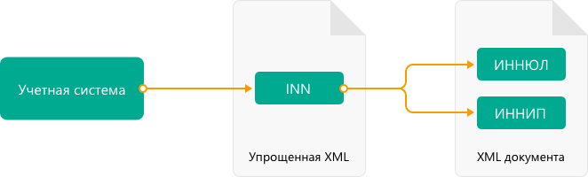

Работа с документами в 820 формате
==================================

`Приказом ФНС России от 19.12.2018 №ММВ-7-15/820@ <https://normativ.kontur.ru/document?moduleId=1&documentId=328588>`_ утвержден новый формат электронных докуменов, который можно использовать как:

- счет-фактуру;
- первичный документ, подтверждающий совершение хозяйственной операции;
- универсальный передаточный документ (УПД), который совмещает в себе счет-фактуру и первичный документ, подтверждающий совершение хозяйственной операции.

.. note::
	Форма универсального передаточного документа, а также рекомендации по его заполнению приведены в письме ФНС России `от 21.10.13 № ММВ-20-3/96@ <https://normativ.kontur.ru/document?moduleId=1&documentId=220334>`__.
    
Рассмотрим на примере УПД сценарий работы с документами 820 формата. Методы и подходы, описанные ниже, можно использовать также для работы с накладными, актами и счетами-фактурами в 820 формате.

Сценарий включает в себя следующие шаги:

*Продавец*:

- генерирует титул продавца,
- отправляет его покупателю.

*Покупатель*:

- получает титул продавца
- при необходимости парсит полученный титул, 
- генерирует титул покупателя,
- отправляет его продавцу.

Генерация титула продавца
-------------------------

Для генерации необходимо использовать метод :doc:`../http/GenerateTitleXml`.

В теле запроса должен содержаться упрощенный XML-файл, соответствующий XSD-схеме контракта для генерации титула. XSD-схема контракта, необходимого для генерации титула, может быть получена с помощью ссылки, доступной в поле ``UserDataXsdUrl`` контракта :doc:`DocumentTitle <../proto/DocumentTypeDescription>`, который можно получить с помощью метода-справочника :doc:`../http/GetDocumentTypes`.

Вызовем метод :doc:`GetDocumentTypes` и найдем интересующие нас тип-функцию-версию. Для УПД в 820 формате возьмем следующие значения:

- ``TypeNamedId`` = ``UniversalTransferDocument``
- ``Function`` = ``СЧФДОП``
- ``Version`` = ``utd820_05_01_02_hyphen``
- ``IndexTitle`` = ``0`` (титул продавца)

*Ответ метода GetDocumentTypes*:

.. sourcecode:: json

    "Name": "UniversalTransferDocument",
    "Title": "УПД",
    "SupportedDocflows": [0],
    "RequiresFnsRegistration": true,
    "Functions": [
        {
            "Name": "СЧФДОП",
            "Versions": [
                {
                    "Version": "utd820_05_01_02_hyphen",
                    "SupportsContentPatching": true,
                    "SupportsEncrypting": true,
                    "SupportsPredefinedRecipientTitle": false,
                    "SupportsAmendmentRequest": true,
                    "Titles": [
                        {
                            "Index": 0,
                            "IsFormal": true,
                            "XsdUrl": "/GetContent?typeNamedId=UniversalTransferDocument&function=СЧФДОП&version=utd820_05_01_02_hyphen&titleIndex=0&contentType=TitleXsd",
                            "UserDataXsdUrl": "/GetContent?typeNamedId=UniversalTransferDocument&function=СЧФДОП&version=utd820_05_01_02_hyphen&titleIndex=0&contentType=UserContractXsd",
                            "SignerInfo":
                            {
                                "SignerType": 2,
                                "ExtendedDocumentTitleType": 0
                            },
                            "MetadataItems": [...],
                            "EncryptedMetadataItems": [...]
                        }
                    ],
                    "IsActual": true,
                    "Workflows": [
                        {
                            "Id": 16,
                            "IsDefault": true
                        },
                        {
                            "Id": 5,
                            "IsDefault": false
                        }
                    ]
                }
            ]
        }
    ]

Теперь нужно подготовить контент для титула. Титул — это xml-файл, соответствующий xsd-схеме. Часть данных в титуле может быть заполнена только пользователем — это информация о товарах, услугах и т.д. А часть данных может быть заполнена автоматически на основании формата и информации в Диадоке. Например, заполнить реквизиты организации продавца и покупателя по идентификатору ящика, установить значения КНД, версии формата, версии программы и т.д. Для упрощения генерации, Диадок позволяет заполнить только «пользовательский» xml-файл, он же *UserDataXml*. На базе *UserDataXml* метод генерации сформирует основной титул, дополнив его всеми необходимыми данными согласно xsd-схеме.

Общая схема работы:

Как формировать *UserDataXml* — выбор разработчика интеграционного решения. Один из путей — это кодогенерация из xsd-схемы упрощённого титула. Ссылка на схему находится в поле ``UserDataXsdUrl`` ответа метода :doc:`../http/GetDocumentTypes`, приведенного выше.

В C# SDK для всех версий формата приказа №820 есть `пример кодогенерации <https://github.com/diadoc/diadocsdk-csharp/tree/master/src/DataXml>`_. 

Кодогенерация осуществлена `инструментом xsd.exe <https://docs.microsoft.com/ru-ru/dotnet/standard/serialization/xml-schema-definition-tool-xsd-exe>`_.

Чтобы воспользоваться ей в C#-клиенте, достаточно заполнить объект ``UniversalTransferDocument`` для титула отправителя (или ``UniversalTransferDocumentBuyerTitle`` для титула получателя) и затем `сериализовать в XML <https://github.com/diadoc/diadocsdk-csharp/blob/master/src/XmlSerializerExtensions.cs>`_.

Итого, имея идентификаторы типа, функции, версии, порядкового номера титула, а также пользовательский контент, можно получить сам титул УПД.

*Пример http-запроса*:

.. sourcecode:: http

    POST /GenerateTitleXml?boxId=a96be310-0982-461a-8b2a-91d198b7861c&documentTypeNamedId=UniversalTransferDocument&documentFunction=СЧФДОП&documentVersion=utd820_05_01_02_hyphen&titleIndex=0 HTTP/1.1
    Host: diadoc-api.kontur.ru
    Authorization: DiadocAuth ddauth_api_client_id={{ключ разработчика}}, ddauth_token={{авторизационный токен}}
    Content-Type: application/xml; charset=utf-8

*Пример UserDataXml (тело запроса)*:

.. sourcecode:: xml

    <?xml version="1.0" encoding="utf-8"?>
    <UniversalTransferDocumentWithHyphens Function="СЧФДОП"
		   DocumentDate="01.08.2019"
		   DocumentNumber="140"
		   DocumentCreator="1"
		   DocumentCreatorBase="1"
		   CircumFormatInvoice="4"
		   Currency="643" >
        <Sellers>
            <Seller>
                <OrganizationDetails OrgType="2"
						 Inn="114500647890"
						 FnsParticipantId="2BM-participantId1"
						 OrgName="ИП Продавец Иван Иванович">
                    <Address>
                        <RussianAddress Region="02"/>
                    </Address>
                </OrganizationDetails>
            </Seller>
        </Sellers>
        <Buyers>
            <Buyer>
                <OrganizationReference OrgType="1"
					 BoxId="53d55d52-9317-4ad4-a7d9-5e9dd3cd6367"/>
            </Buyer>
        </Buyers>
        <Table TotalWithVatExcluded="0" Vat="0" Total="0">
            <Item Product="Товарная позиция"
				Unit="796"
				Quantity="0"
				Price="0"
				TaxRate="без НДС"
				SubtotalWithVatExcluded="0"
				Vat="0"
				Subtotal="0"
				Excise="10"/>
        </Table>
        <TransferInfo OperationInfo="Товары переданы"/>
        <Signers>
            <SignerDetails Inn="123456789047"
				 LastName="Подписантов"
				 FirstName="Иван"
				 MiddleName="Иванович"
				 RegistrationCertificate="1"
				 SignerPowers="0"
				 SignerType="3"
				 SignerStatus="1"
				 SignerPowersBase="Должностные обязанности"/>
        </Signers>
    </UniversalTransferDocumentWithHyphens>

	
*Пример получившегося титула (тело ответа)*:

.. sourcecode:: xml

    <?xml version="1.0" encoding="windows-1251"?>
    <Файл ИдФайл="ON_NSCHFDOPPR_2BM-9670670494-967001000-202201240241297341956_2BM-participantId1_20220124_f972e93e-4c69-4c9e-9656-be3a5a072e72" ВерсФорм="5.01" ВерсПрог="Diadoc 1.0">
        <СвУчДокОбор ИдОтпр="2BM-participantId1" ИдПол="2BM-9670670494-967001000-202201240241297341956">
            <СвОЭДОтпр ИННЮЛ="6663003127" ИдЭДО="2BM" НаимОрг="АО &quot;ПФ &quot;СКБ Контур&quot;" />
        </СвУчДокОбор>
        <Документ КНД="1115131" ВремИнфПр="18.17.45" ДатаИнфПр="24.01.2022" НаимЭконСубСост="1" Функция="СЧФДОП" ПоФактХЖ="Документ об отгрузке товаров (выполнении работ), передаче имущественных прав (документ об оказании услуг)" НаимДокОпр="Счет-фактура и документ об отгрузке товаров (выполнении работ), передаче имущественных прав (документ об оказании услуг)" ОснДоверОргСост="1">
            <СвСчФакт НомерСчФ="140" ДатаСчФ="01.08.2019" КодОКВ="643">
                <СвПрод>
                    <ИдСв>
                        <СвИП ИННФЛ="114500647890">
                            <ФИО Фамилия="Продавец" Имя="Иван" Отчество="Иванович" />
                        </СвИП>
                    </ИдСв>
                    <Адрес>
                        <АдрРФ КодРегион="02" />
                    </Адрес>
                </СвПрод>
                <СвПокуп>
                    <ИдСв>
                        <СвЮЛУч НаимОрг="Документация-получатель" ИННЮЛ="9670670494" КПП="967001000" />
                    </ИдСв>
                    <Адрес>
                        <АдрРФ Индекс="777777" КодРегион="50" Город="г. Москва" />
                    </Адрес>
                </СвПокуп>
                <ДопСвФХЖ1 НаимОКВ="Российский рубль" ОбстФормСЧФ="4" />
            </СвСчФакт>
            <ТаблСчФакт>
                <СведТов НомСтр="1" НаимТов="Товарная позиция" ОКЕИ_Тов="796" КолТов="0" ЦенаТов="0.00" СтТовБезНДС="0.00" НалСт="без НДС" СтТовУчНал="0.00">
                    <Акциз>
                        <СумАкциз>
                            10.00
                        </СумАкциз>
                        </Акциз>
                    <СумНал>
                        <СумНал>0.00
                        </СумНал>
                    </СумНал>
                    <ДопСведТов НаимЕдИзм="шт" />
                </СведТов>
                <ВсегоОпл СтТовБезНДСВсего="0.00" СтТовУчНалВсего="0.00">
                    <СумНалВсего>
                        <СумНал>
                            0.00
                        </СумНал>
                    </СумНалВсего>
                </ВсегоОпл>
            </ТаблСчФакт>
            <СвПродПер>
                <СвПер СодОпер="Товары переданы">
                    <ОснПер НаимОсн="Без документа-основания" />
                </СвПер>
            </СвПродПер>
            <Подписант ОснПолн="Должностные обязанности" ОблПолн="0" Статус="1">
                <ФЛ ИННФЛ="123456789047">
                    <ФИО Фамилия="Подписантов" Имя="Иван" Отчество="Иванович" />
                </ФЛ>
            </Подписант>
        </Документ>
    </Файл>

	
Отправка документа
------------------

Сценариев отправки может быть несколько:

- Загрузить документ как Черновик. Это можно сделать через API и в веб-интерфейсе. В веб-интерфейсе подписать черновик и отправить
- Загрузить документ как Исходящий неотправленный. Это можно сделать через API или в веб-интерфейсе. В веб-интерфейсе подписать документ и отправить
- Подписать и отправить документ полностью через API

Для всех трех случаев необходимо использовать метод :doc:`..http/PostMessage` со структурой ``DocumentAttachment``. В зависимости от сценария отправки передаваемый контент в теле запроса будет разный.

Рассмотрим пример третьего варианта, когда документ сразу подписывается и отправляется. Как сформировать подпись для документа определяет разработчик интеграционного решения.

*Тело запроса PostMessage*

.. sourcecode:: xml

    {
     "FromBoxId": "a96be310-0982-461a-8b2a-91d198b7861c",
     "ToBoxId": "13254c42-b4f7-4fd3-3324-0094aeb0f15a",
     "DocumentAttachments": [
            {
                "SignedContent":
                {
                    "Content": "PD94bWwgdmVyc2lvbj0iMS4wIiBlbmNvZGluZz0...NC50Ls+",        //контент xml-файла в кодировке base-64
                    "Signature": "MIIN5QYJKoZIhvcNAQcCoIIN1jCCDdIA...kA9MJfsplqgW",       //контент файла подписи в кодировке base-64
                },
                "TypeNamedId": "UniversalTransferDocument",
                "Function": "СЧФДОП",
                "Version": "utd820_05_01_02_hyphen"
            }
        ]
    }

Получение титула продавца в ящике покупателя
---------------------------------------------

Титул продавца доставлен в ящик получателя. Об этом можно узнать при помощи методов чтения ленты новостей :doc:`../http/GetNewEvents` и :doc:`../http/GetDocflowEvents_V3`. Как понять, что это документ именно 820 формата? В ответе каждого из методов чтения ленты новостей возвращается версия документа (поле ``Version``). Для документов 820 формата версия будет начинаться с ``utd820`` (например, ``utd820_05_01_02_hyphen``).

Из ленты новостей можно определить идентификатоы документа ``MessageId``, ``DocumentId`` и при необходимости запросить дополнительную информацию по документу, используя методы :doc:`../http/GetMessage`, :doc:`../http/GetDocument`, :doc:`../http/GetDocflows_V3`.

Парсинг документа
-------------------

Парсинг полученного титула можно не выполнять, а достать все необходимые данные сразу из полученного титула продавца. Но если интегратору удобнее работать с упрощенным xml (*UserDataXml*), то можно выполнить парсинг при помощи метода :doc:`../http/ParseTitleXml`. 

Для того, чтобы распарсить документ, нужно знать тип документа, функцию, версию, номер титула. Тип, функцию и версию можно узнать из ответов методов :doc:`../http/GetNewEvents`, :doc:`../http/GetMessage`, :doc:`../http/GetDocument`, :doc:`../http/GetDocflowEvents_V3`,  :doc:`../http/GetDocflows_V3` или использовать метод детектирования :doc:`../http/DetectDocumentTypes` для полученного титула продавца. 

*Пример http-запроса*:

.. sourcecode:: http

    POST /ParseTitleXml?boxId=13254c42-b4f7-4fd3-3324-0094aeb0f15a&documentTypeNamedId=UniversalTransferDocument&documentFunction=СЧФДОП&documentVersion=utd820_05_01_02_hyphen&titleIndex=0 HTTP/1.1
        Host: diadoc-api.kontur.ru
        Authorization: DiadocAuth ddauth_api_client_id={{ключ разработчика}}, ddauth_token={{авторизационный токен}}
        Content-Type: application/xml; charset=utf-8

В теле запроса должен быть xml полученного титула.

В теле ответа будет упрощенный xml (*UserDataXml*), аналогичный тому, который был использован при генерации. Не всегда упрощенный xml в теле ответа метода парсинга будет совпадать с упрощенным xml в теле запроса метода генерации. Это связано с тем, что при генерации документа мы можем автоматически заполнять какие-то данные в титуле. Например по идентификатору ящика можно определить все его реквизиты - ИНН, КПП, наименование и т.д. Соответственно после парсинга в упрощенном xml будут указаны ИНН, КПП и наименование организации, а не идентификатор ящика, как это было до генерации.

Каким образом дальше работать с полученным упрощенным xml, чтобы данные из него загрузить в свою учетную систему (или использовать для других целей), — решает интегратор. 

Генерация титула покупателя
---------------------------

Генерация титула покупателя выполняется аналогично титулу продавца. 

Для генерации используйте метод :doc:`../http/GenerateTitleXml`. В теле запроса должен содержаться упрощенный XML-файл (*UserDataXml*), соответствующий XSD-схеме контракта, который мы использовали для генерации титула. В теле ответа будет xml титула покупателя.

Для получения xsd-схемы вызовем метод :doc:`../http/GetDocumentTypes` и найдем интересующие нас тип-функцию-версию. Для титула покупателя УПД в 820 формате возьмем те же значения, что и для титула продавца, но номер титула будет другой:

- ``TypeNamedId`` = ``UniversalTransferDocument``
- ``Function`` = ``СЧФДОП``
- ``Version`` = ``utd820_05_01_02_hyphen``
- ``IndexTitle`` = ``1`` (титул покупателя)
 
*Ответ метода GetDocumentTypes*:

.. sourcecode:: json

    "Name": "UniversalTransferDocument",
    "Title": "УПД",
    "SupportedDocflows": [0],
    "RequiresFnsRegistration": true,
    "Functions": [
        {
            "Name": "СЧФДОП",
            "Versions": [
                {
                    "Version": "utd820_05_01_02_hyphen",
                    "SupportsContentPatching": true,
                    "SupportsEncrypting": true,
                    "SupportsPredefinedRecipientTitle": false,
                    "SupportsAmendmentRequest": true,
                    "Titles": [
                        {
                            "Index": 1,
                            "IsFormal": true,
                            "XsdUrl": "/GetContent?typeNamedId=UniversalTransferDocument&function=СЧФДОП&version=utd820_05_01_02_hyphen&titleIndex=1&contentType=TitleXsd",
                            "UserDataXsdUrl": "/GetContent?typeNamedId=UniversalTransferDocument&function=СЧФДОП&version=utd820_05_01_02_hyphen&titleIndex=1&contentType=UserContractXsd",
                            "SignerInfo":
                            {
                                "SignerType": 2,
                                "ExtendedDocumentTitleType": 8
                            },
                            "MetadataItems": [...],
                            "EncryptedMetadataItems": [...]
                        }
                    ],
                    "IsActual": true,
                    "Workflows": [
                        {
                            "Id": 16,
                            "IsDefault": true
                        },
                        {
                            "Id": 5,
                            "IsDefault": false
                        }
                    ]
                }
            ]
        }
    ]

Далее необходимо подготовить *UserDataXml*. Как это делается подробно описано для титула продавца.
 
После того, как *UserDataXml* готов, можно запускать генерацию титула покупателя.
 
*Пример http-запроса*:

.. sourcecode:: http

    POST /GenerateTitleXml?boxId=13254c42-b4f7-4fd3-3324-0094aeb0f15&documentTypeNamedId=UniversalTransferDocument&documentFunction=СЧФДОП&documentVersion=utd820_05_01_02_hyphen&titleIndex=1&letterId=93bdfb88-7b80-484d-883d-765102ca5af5&documentId=fc3c3811-3368-4e47-95f4-5334b9a42654 HTTP/1.1
    Host: diadoc-api.kontur.ru
    Authorization: DiadocAuth ddauth_api_client_id={{ключ разработчика}}, ddauth_token={{авторизационный токен}}
    Content-Type: application/xml; charset=utf-8
 
*Пример UserDataXml (тело запроса)*:

.. sourcecode:: xml

    <?xml version="1.0" encoding="utf-8"?>
    <UniversalTransferDocumentBuyerTitle DocumentCreator="ИП Покупатель Иван Иванович" OperationContent="Принято без претензий" xmlns:xs="http://www.w3.org/2001/XMLSchema">
        <Signers>
            <SignerDetails LastName="Покупатель" 
			   FirstName="Иван" 
			   MiddleName="Иванович" 
			   SignerPowers="1" 
			   SignerPowersBase="Должностные обязанности" 
			   SignerStatus="5" 
			   SignerType="2" 
			   Inn="114500647890" />
        </Signers>
    </UniversalTransferDocumentBuyerTitle>

*Пример получившегося титула покупателя (тело ответа)*:

.. sourcecode:: xml

    <?xml version="1.0" encoding="windows-1251"?>
    <Файл ИдФайл="ON_NSCHFDOPPOK_2BM-participantId1_2BM-participantid2_f3caa5ab-5033-431f-ba0d-3312ee82b25b" ВерсФорм="5.01" ВерсПрог="Diadoc 1.0">
      <СвУчДокОбор ИдОтпр="2BM-7750370234-4012052808304878702630000000000" ИдПол="2BM-7750370234-4012052808304878702630000000004">
        <СвОЭДОтпр ИННЮЛ="6663003127" ИдЭДО="2BM" НаимОрг="АО &quot;ПФ &quot;СКБ Контур&quot;" />
      </СвУчДокОбор>
      <ИнфПок КНД="1115132" ВремИнфПок="14.50.14" ДатаИнфПок="17.10.2019" НаимЭконСубСост="ИП Покупатель Иван Иванович">
        <ИдИнфПрод ВремФайлИнфПр="14.32.21" ДатаФайлИнфПр="20.05.2019" ИдФайлИнфПр="ON_NSCHFDOPPR_2BM-participantId2_2BM-participantId1_20191011_2ebfc880-6e31-4042-8302-c5201523fc3c">
          <ЭП>MIAGCSqGSIb3DQEHAq...agAAAAAAAA==</ЭП>
        </ИдИнфПрод>
        <СодФХЖ4 ДатаСчФИнфПр="01.02.2003" НаимДокОпрПр="Счет-фактура и документ об отгрузке товаров (выполнении работ), передаче имущественных прав (документ об оказании услуг)" Функция="СЧФДОП" НомСчФИнфПр="140">
          <СвПрин СодОпер="Принято без претензий" />
        </СодФХЖ4>
        <Подписант ОснПолн="Должностные обязанности" ОблПолн="1" Статус="5">
          <ИП ИННФЛ="114500647890">
            <ФИО Фамилия="Покупатель" Имя="Иван" Отчество="Иванович" />
          </ИП>
        </Подписант>
      </ИнфПок>
    </Файл>

Отправка титула покупателя
--------------------------

Готовый титул покупателя можно подписать и отправить продавцу при помощи метода :doc:`../http/PostMessagePatch`. Как сформировать подпись определяет разработчик интеграционного решения.

*Пример http-запроса для отправки документа*

.. sourcecode:: http

    POST /V3/PostMessagePatch HTTP/1.1
        Host: diadoc-api.kontur.ru
        Authorization: DiadocAuth ddauth_api_client_id={{ключ разработчика}}, ddauth_token={{авторизационный токен}}
        Content-Type: application/json; charset=utf-8
    
*Тело запроса*:
 
.. sourcecode:: xml
 
    "BoxId": "13254c42-b4f7-4fd3-3324-0094aeb0f15",
    "MessageId": "93bdfb88-7b80-484d-883d-765102ca5af5",
    "RecipientTitles":
    [
        {
            "ParentEntityId":"fc3c3811-3368-4e47-95f4-5334b9a42654",
            "SignedContent":
            {
                "Content": "PD94bWwgdmVyc2l...LDQudC7Pg==",

            "Signature": "MIIN5QYJKoZIhvc...KsTM6zixgz"
            }
        }
     ]
 
В результате получаем УПД с подписанными двумя титулами.
 
В данной статье не рассмотрены примеры для генерации и отправки извещений о получении, а также запроса уточнения. С ними работа осуществляется также, как и для документов в 155 формате: 

- для генерации xml-файла извещения необходимо использовать метод :doc:`../http/GenerateReceiptXml`,
- для отправки извещения - метод :doc:`../http/PostMessagePatch` и структуру Receipt,
- для отправки запроса уточнения - метод :doc:`../http/PostMessagePatch` и структуру CorrectionRequest
 

Схемы титулов и UserDataXml
---------------------------
Актуальные xsd-схемы титулов и *UserDataXml* рекомендум получать при помощи метода :doc:`../http/GetDocumentTypes`.
 
Ниже приведены xsd-схемы для версии utd820_05_01_02_hyphen:
 
 - :download:`XSD-схема титула продавца <../xsd/ON_NSCHFDOPPR_1_997_01_05_01_03.xsd>`; 
 - :download:`XSD-схема титула покупателя <../xsd/ON_NSCHFDOPPOK_1_997_02_05_01_02.xsd>`; 
 - :download:`XSD-схема упрощенного xml (UserDataXsd) для титула продавца <../xsd/ON_NSCHFDOPPR_UserContract_820_05_01_02_Hyphen.xsd>`; 
 - :download:`XSD-схема упрощенного xml (UserDataXsd) для титула покупателя <../xsd/ON_NSCHFDOPPOK_UserContract_820_05_01_02.xsd>`.
 
 
