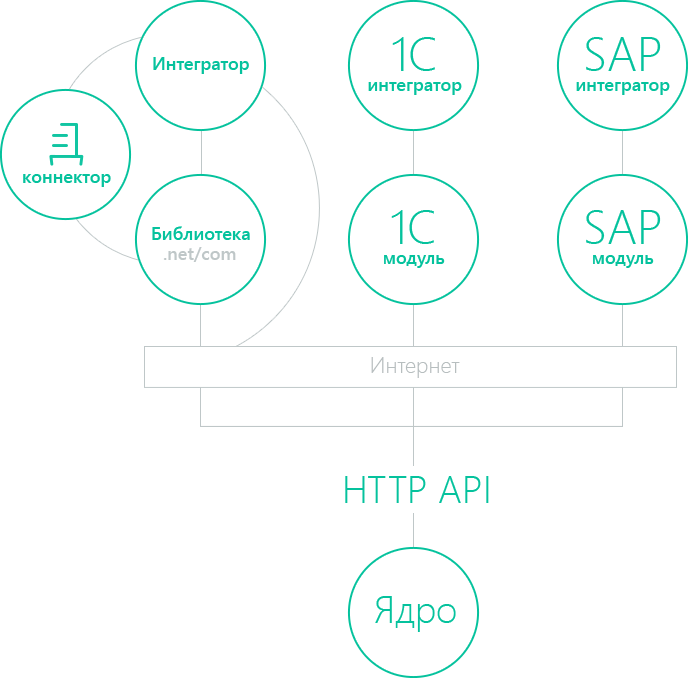

Возможности для интеграции
==========================

Выбор способа работы с API Диадок зависит от решаемых задач, требований к клиентской части и доступных средств разработки.

HTTP API
--------

Базовый уровень интеграции — **HTTP API**.
На этом уровне строятся платформо-независимые интеграционные решения. Это значит, что с HTTP API могут работать клиентские приложения, которые написаны на разных языках программирования и запускаются под разными операционными системами.

Готовые интеграционные решения
------------------------------

Клиентские приложения могут обращаться напрямую к HTTP API Диадока, а могут использовать одно из готовых решений:

- `Диадок.Коннектор <https://www.diadoc.ru/integrations/dd_connector>`__ — облачное решение, которое интегрирует Диадок с учетной системой. Подойдет компаниям со сложными бизнес-процессами и большим объемом документооборота.
- `SDK Диадока <https://diadoc.kontur.ru/sdk/>`__ — набор готовых инструментов для разработки клиентских приложений. Он включает в себя решения на языках:

 - `C# <https://github.com/diadoc/diadocsdk-csharp>`__ — представляет собой исходный код :doc:`библиотеки .NET/COM <DiadocApiDll>`, которая предназначена для клиентских приложений на технологиях Microsoft
 - `C++ <https://github.com/diadoc/diadocsdk-cpp>`__ — представляет собой исходный код `внешней компоненты <https://1c-docs.diadoc.ru/ru/latest/>`__
 - `Java <https://github.com/diadoc/diadocsdk-java>`__
 
- `1С модуль <https://www.diadoc.ru/integrations/1c>`__ — решает задачи стыковки 1С-решений с Диадоком.
-  `Внешняя компонента <https://1c-docs.diadoc.ru/ru/latest/>`__ — библиотека для 1С модулей. Написана на языке C++ и не содержит лишних зависимостей, поэтому работает на любой Windows-системе без установки дополнительных модулей.
- `SAP модуль <https://www.diadoc.ru/integrations/sap>`__ — комплекс Контур-ERP для SAP. Обеспечивает бесшовную интеграцию SAP ERP с Диадоком.

.. toctree::
	:name: com
	:hidden:

	DiadocApiDll