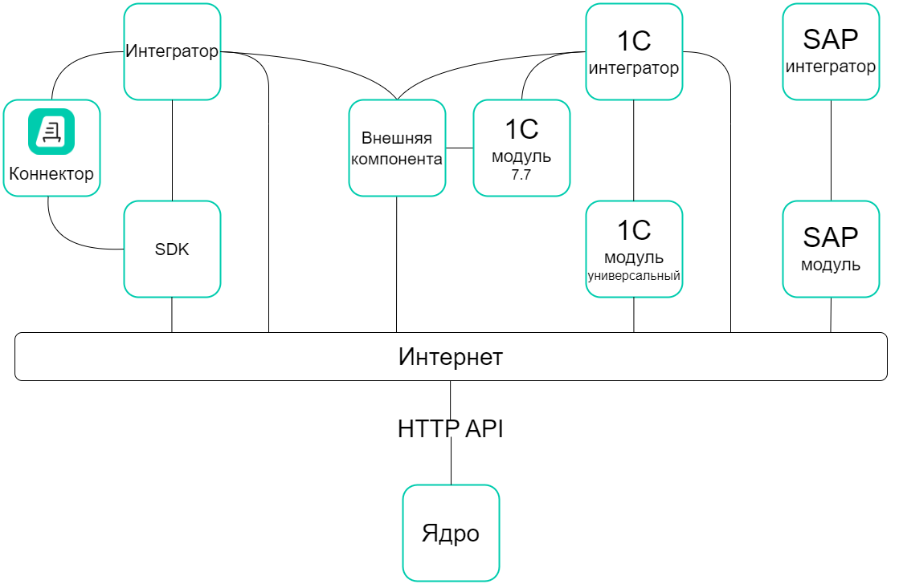

Варианты интеграции
===================

В зависимости от ваших задач, требований к клиентской части и доступных средств разработки вы можете выбрать один из нижеперечисленных способов интеграции с API Диадока.

HTTP API
--------

**HTTP API** — базовый уровень интеграции.
Преимущество этого способа интеграции в том, что на уровне HTTP API можно построить платформо-независимые решения. Это значит, что с HTTP API могут работать клиентские приложения, которые написаны на разных языках программирования и запускаются под разными операционными системами.

Но этот способ имеет свой недостаток: все сложности взаимодействия клиентской части с API через HTTP разработчик должен взять на себя.

Эта документация описывает работу именно с HTTP API: его подходы, инструменты и методы.

Чтобы интегрироваться с Диадоком с помощью HTTP API, следуйте :doc:`инструкции <integration>`.

Готовые интеграционные решения
------------------------------

Чтобы облегчить сложности взаимодействия клиентской части с HTTP API, разработаны готовые решения, которые разработчики могут использовать в своих приложениях.
То есть клиентские приложения могут обращаться напрямую к HTTP API Диадока, а могут использовать одно из готовых решений:

- `Диадок.Коннектор <https://www.diadoc.ru/integrations/dd_connector>`__ — облачное решение, которое интегрирует Диадок с учетной системой. Подойдет компаниям со сложными бизнес-процессами и большим объемом документооборота.

- `SDK Диадока <https://diadoc.kontur.ru/sdk/>`__ — набор готовых инструментов для разработки клиентских приложений. Включает в себя решения на языках:

 - `C# <https://github.com/diadoc/diadocsdk-csharp>`__,
 - `Java <https://github.com/diadoc/diadocsdk-java>`__,
 - `C++ <https://github.com/diadoc/diadocsdk-cpp>`__ — с 01.01.2024 не поддерживается и не обновляется.

 Для интеграторов, ведущих разработку в стеке технологий Microsoft, доступна клиентская :doc:`библиотека .NET/COM <DiadocApiDll>`.

- `1С модуль <https://www.diadoc.ru/integrations/1c>`__ — решает задачи стыковки 1С-решений с Диадоком.

- `Внешняя компонента <https://1c-docs.diadoc.ru/ru/latest/>`__ — библиотека для интеграции учётных систем с Диадоком через COM-интерфейс. Написана на языке C++ и не содержит лишних зависимостей, поэтому работает на любой Windows-системе без установки дополнительных модулей. Компонента может загружаться как внешняя компонента по технологии 1С или как классический COM-объект.

- `SAP модуль <https://www.diadoc.ru/integrations/sap>`__ — комплекс Контур-ERP для SAP. Обеспечивает бесшовную интеграцию SAP ERP с Диадоком.

.. toctree::
	:hidden:

	DiadocApiDll