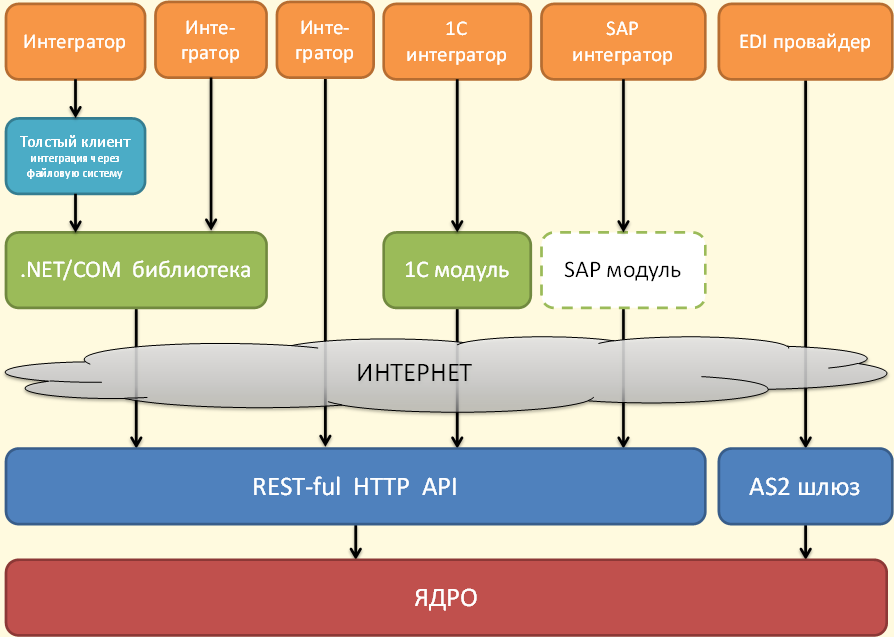

Возможности для интеграции
==========================

|image0|

Выбор способа работы с API Диадок зависит от решаемых задач, требований к клиентской части и доступных средств разработки.

HTTP API
--------

Базовый уровень интеграции - **HTTP API**.
На этом уровне строятся платформо-независимые интеграционные решения. Это значит, что с HTTP API могут работать клиентские приложения, которые написаны на разных языках программирования и запускаются под разными операционными системами.

Готовые нтеграционные решения
-----------------------------

Клиентские приложения могут обращаться напрямую к HTTP API Диадока, а могут использовать одно из готовых решений:

- :doc:`Библиотека .NET/COM <DiadocApiDll>` - библиотека для клиентских приложений, которые построены на технологиях Microsoft. Входит в состав `SDK Диадока <#sdk>`__ вместе с инструментами для других языков.

- `Диадок.Коннектор <https://www.diadoc.ru/integrations/dd_connector>`__ - облачное решение, которое интегрирует Диадок с учетной системой. Подойдет компаниям со сложными бизнес-процессами и большим объемом документооборота.

- `1С модуль <https://www.diadoc.ru/integrations/1c>`__ - решает задачи стыковки 1С-решений с Диадоком. Написан на языке C++ и не содержит лишних зависимостей, поэтому работает на любой Windows-системе без установки дополнительных модулей.

- `SAP модуль <https://www.diadoc.ru/integrations/sap>`__ - комплекс Контур-ERP для SAP. Обеспечивает бесшовную интеграцию SAP ERP с Диадоком.

.. toctree::
   :name: com
   :hidden:
    
   DiadocApiDll
   
SDK
---

`SDK Диадока <https://diadoc.kontur.ru/sdk/>`__ - набор готовых инструментов для разработки клиентских приложений. Он включает в себя решения для языков:

- `C# <https://github.com/diadoc/diadocsdk-csharp>`__ - представляет собой исходный код :doc:`библиотеки .NET/COM <DiadocApiDll>`
- `C++ <https://github.com/diadoc/diadocsdk-cpp>`__
- `Java <https://github.com/diadoc/diadocsdk-java>`__

А из приложений на Visual Basic и JavaScript можно работать с Диадоком через COM-сервисы библиотеки .NET/COM.

