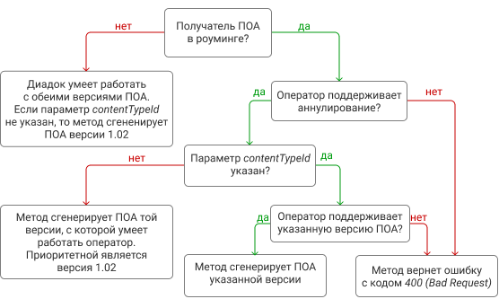

GenerateRevocationRequestXml
============================

Метод генерирует предложение об аннулировании.

Версии метода:

-  :ref:`GenerateRevocationRequestXml_v2`

-  :ref:`GenerateRevocationRequestXml_v1`

.. _GenerateRevocationRequestXml_v2:

v2
--

Имя ресурса: **/V2/GenerateRevocationRequestXml**

HTTP метод: **POST**

Параметры строки запроса:

- *boxId*: идентификатор ящика

- *messageId*: идентификатор сообщения

- *attachmentId*: идентификатор сущности документа, для которого требуется изготовить предложение об аннулировании

- *сontentTypeId*: задает, какую версию предложения об аннулировании нужно сгенерировать; принимает одно из значений:
 - revocation_request_01 — для предложения об аннулировании версии 1.01
 - revocation_request_02 — для предложения об аннулировании версии 1.02
 Поведение метода зависит от того, кому отправляется предложение об аннулировании (ПОА):
 

 
В запросе должен присутствовать HTTP-заголовок ``Authorization`` с необходимыми данными для :doc:`авторизации <../Authorization>`.

В теле запроса должны содержаться данные для изготовления предложения об аннулирования документа, в виде сериализованной структуры :doc:`../proto/RevocationRequestInfo`.

В теле ответа содержится XML-файл с предложением об аннулировании документа *attachmentId* из сообщения *messageId* в ящике *boxId*. Файл с предложением изготавливается в соответствии с :download:`XML-схемой <../xsd/DP_PRANNUL_1_985_00_01_01_02.xsd>`.

Имя файла с предложением передается в стандартном HTTP-заголовке *Content-Disposition*.

Для вызова этого метода текущий пользователь должен иметь доступ к исходному документу, в противном случае возвращается код ошибки *403 (Forbidden)*.

Возможные HTTP-коды возврата:

-  200 (OK) — операция успешно завершена

-  400 (Bad Request) — данные в запросе имеют неверный формат или отсутствуют обязательные параметры

-  401 (Unauthorized) — в запросе отсутствует HTTP-заголовок ``Authorization``, или в этом заголовке содержатся некорректные авторизационные данные

-  403 (Forbidden) — доступ к ящику с предоставленным авторизационным токеном запрещен

-  404 (Not Found) — в указанном ящике нет сообщения с идентификатором *messageId*, либо в указанном сообщении нет сущности с идентификатором *attachmentId*, либо указанная сущность имеет неверный тип, либо у указанной сущности нет дочерней сущности типа *Signature*

-  405 (Method not allowed) — используется неподходящий HTTP-метод

-  409 (Conflict) — формирование предложения об аннулировании документа невозможно

-  500 (Internal server error) — при обработке запроса возникла непредвиденная ошибка

.. _GenerateRevocationRequestXml_v1:

v1
--

Имя ресурса: **/GenerateRevocationRequestXml**

HTTP метод: **POST**

Параметры строки запроса:

-  *boxId*: идентификатор ящика

-  *messageId*: идентификатор сообщения

-  *attachmentId*: идентификатор сущности документа, для которого требуется изготовить предложение об аннулировании

В запросе должен присутствовать HTTP-заголовок ``Authorization`` с необходимыми данными для :doc:`авторизации <../Authorization>`.

В теле запроса должны содержаться данные для изготовления предложения об аннулирования документа, в виде сериализованной структуры :doc:`../proto/RevocationRequestInfo`.

В теле ответа содержится XML-файл с предложением об аннулировании документа *attachmentId* из сообщения *messageId* в ящике *boxId*. Файл с предложением изготавливается в соответствии с :download:`XML-схемой <../xsd/DP_PRANNUL_1_985_00_01_01_01.xsd>`.

Имя файла с предложением передается в стандартном HTTP-заголовке *Content-Disposition*.

Для вызова этого метода текущий пользователь должен иметь доступ к исходному документу, в противном случае возвращается код ошибки *403 (Forbidden)*.

Возможные HTTP-коды возврата:

-  200 (OK) — операция успешно завершена

-  400 (Bad Request) — данные в запросе имеют неверный формат или отсутствуют обязательные параметры

-  401 (Unauthorized) — в запросе отсутствует HTTP-заголовок ``Authorization``, или в этом заголовке содержатся некорректные авторизационные данные

-  403 (Forbidden) — доступ к ящику с предоставленным авторизационным токеном запрещен

-  404 (Not Found) — в указанном ящике нет сообщения с идентификатором *messageId*, либо в указанном сообщении нет сущности с идентификатором *attachmentId*, либо указанная сущность имеет неверный тип, либо у указанной сущности нет дочерней сущности типа *Signature*

-  405 (Method not allowed) — используется неподходящий HTTP-метод

-  409 (Conflict) — формирование предложения об аннулировании документа невозможно

-  500 (Internal server error) — при обработке запроса возникла непредвиденная ошибка