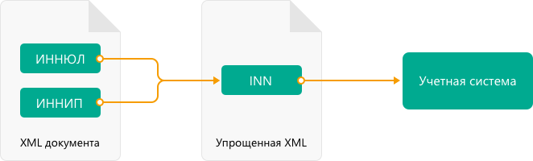

ParseTitleXml
==========================

Парсинг используется для того, чтобы "разобрать" документ на составляющие его элементы и получить значения этих элементов.
Типовые сценарии, когда используется парсинг:

- данные из документа в Диадоке нужно занести в учетную систему пользователя
- для генерации титулов последующих участников нужно взять данные из предыдущих титулов
- в зависимости от контента документа выполнять различные действия с документом
- и т.д.

Xml-файлы документов имеют сложную структуру и много зависимостей между элементами, которые надо анализировать при разборе. Например, в качестве продавца в универсальном передаточном документе (УПД) могут быть указаны юридическое лицо (ЮЛ) или индивидуальный предприниматель (ИП). В xml документа однотипные реквизиты (наименование, ИНН и т.д.)  для ЮЛ и ИП находятся в разных элементах, но в учетных системах хранятся в одном объекте.
Поэтому процесс разбора может состоять из шагов:

#. Разобрать xml “как есть”
#. Проанализировать зависимости, составить новый упрощенный xml-файл
#. Разобрать упрощенную xml, записать данные в учетную систему.

Формирование упрощенной xml выполняется при помощи метода парсинга ParseTitleXml. На вход метода необходимо подать заполненный xml-файл титула соответствующего типа документа.  На выходе получается упрощенный xml-файл.

.. http:post:: /ParseTitleXml

    :query boxId: идентификатор ящика
    :query documentTypeNamedId: уникальный строковый идентификатор типа документа
    :query documentFunction:  строковый идентификатор функции, уникальный в рамках типа документа
    :query documentVersion:  строковый идентификатор версии типа документа, уникальный в рамках функции типа документа
    :query titleIndex:  числовой идентификатор титула документа

    :reqheader Authorization: данные, необходимые для :doc:`авторизации <../Authorization>`

    :statuscode 200: операция успешно завершена
    :statuscode 400: данные в запросе имеют неверный формат или отсутствуют обязательные параметры
    :statuscode 401: в запросе отсутствует HTTP-заголовок ``Authorization``, или в этом заголовке содержатся некорректные авторизационные данные
    :statuscode 402: закончилась подписка на API
    :statuscode 403: у пользователя нет доступа к ящику
    :statuscode 405: используется неподходящий HTTP-метод
    :statuscode 500: при обработке запроса возникла непредвиденная ошибка

    В теле запроса должен содержаться заполненный XML-файл титула. Файл изготавливается в соответствии с XSD-схемой соответствующего титула для данного типа документа. XSD-схема титула может быть получена с помощью ссылки, доступной в поле *XsdUrl* контракта :doc:`DocumentTitle <../proto/DocumentTypeDescription>`, который можно получить с помощью метода :doc:`GetDocumentTypes`.
    
    В теле ответа содержится сгенерированный упрощенный XML-файл. XSD-схема упрощенного XML-файла может быть получена с помощью ссылки, доступной в поле *UserDataXsdUrl* контракта :doc:`DocumentTitle <../proto/DocumentTypeDescription>`, который можно получить с помощью метода :doc:`GetDocumentTypes`.
    
    Имя файла сгенерированного титула возвращается в стандартном HTTP-заголовке Content-Disposition.

**Пример запроса**:

    .. sourcecode:: http

        POST /ParseTitleXml?boxId=96339010-4c66-462d-a917-7f31bb8d80c4&documentTypeNamedId=UniversalTransferDocument&documentVersion=utd_05_01_05&documentFunction=СЧФДОП&titleIndex=0 HTTP/1.1
        Host: diadoc-api.kontur.ru
        Authorization: DiadocAuth ddauth_api_client_id=key, ddauth_token=token
        Content-Type: application/xml; charset=utf-8

        <?xml version="1.0" encoding="windows-1251"?>
        <Файл ИдФайл="ON_SCHFDOPPR_2BM-7750370234-4012052808304878702630000000004_2BM-1105198800-2012052808170176862630000000000_20190523_e4409432-021a-4bc6-ba03-5118b485c4d3" ВерсФорм="5.01" ВерсПрог="Diadoc 1.0">
          <СвУчДокОбор ИдОтпр="2BM-1105198800-2012052808170176862630000000000" ИдПол="2BM-7750370234-4012052808304878702630000000004">
            <СвОЭДОтпр ИННЮЛ="6663003127" ИдЭДО="2BM" НаимОрг="АО &quot;ПФ &quot;СКБ Контур&quot;" />
          </СвУчДокОбор>
          <Документ КНД="1115125" Функция="СЧФДОП" ПоФактХЖ="Документ об отгрузке товаров (выполнении работ), передаче имущественных прав (документ об оказании услуг)" НаимДокОпр="Счет-фактура и документ об отгрузке товаров (выполнении работ), передаче имущественных прав (документ об оказании услуг)" ДатаИнфПр="23.05.2019" ВремИнфПр="09.25.29" НаимЭконСубСост="ЗАО &quot;Тестовая Василек&quot;, ИНН 1105198800, КПП 110519880">
            <СвСчФакт НомерСчФ="14456464" ДатаСчФ="23.05.2019" КодОКВ="643">
              <СвПрод>
                <ИдСв>
                  <СвЮЛУч НаимОрг="ЗАО &quot;Тестовая Василек&quot;" ИННЮЛ="1105198800" КПП="110519880" />
                </ИдСв>
                <Адрес>
                  <АдрРФ Индекс="443028" КодРегион="63" Город="город Самара" НаселПункт="поселок Мехзавод" Улица="7-й квартал" Дом="дом 14, 24" />
                </Адрес>
              </СвПрод>
              <СвПРД НомерПРД="15" ДатаПРД="23.05.2019" />
              <СвПокуп>
                <ИдСв>
                  <СвЮЛУч НаимОрг="&quot;ЗАО Очень Древний Папирус&quot;" ИННЮЛ="7750370238" КПП="770100101" />
                </ИдСв>
                <Адрес>
                  <АдрИнф КодСтр="643" АдрТекст="тракт Троицкий 46" />
                </Адрес>
              </СвПокуп>
              <ДопСвФХЖ1 НаимОКВ="Российский рубль" />
            </СвСчФакт>
            <ТаблСчФакт>
              <СведТов НомСтр="1" НаимТов="кольцо" ОКЕИ_Тов="796" КолТов="6" ЦенаТов="11.00" СтТовБезНДС="66.00" НалСт="без НДС" СтТовУчНал="66.00">
                <Акциз>
                  <БезАкциз>без акциза</БезАкциз>
                </Акциз>
                <СумНал>
                  <БезНДС>без НДС</БезНДС>
                </СумНал>
                <ДопСведТов НаимЕдИзм="шт" />
              </СведТов>
              <ВсегоОпл СтТовБезНДСВсего="66.00" СтТовУчНалВсего="66.00">
                <СумНалВсего>
                  <БезНДС>без НДС</БезНДС>
                </СумНалВсего>
              </ВсегоОпл>
            </ТаблСчФакт>
            <СвПродПер>
              <СвПер СодОпер="тест">
                <ОснПер НаимОсн="Отсутствует" />
              </СвПер>
            </СвПродПер>
            <Подписант ОснПолн="Есть" ОблПолн="5" Статус="1">
              <ИП ИННФЛ="667010595160">
                <ФИО Фамилия="АО" Имя="ПФ" Отчество="СКБ Контур" />
              </ИП>
            </Подписант>
          </Документ>
        </Файл>

**Пример ответа**:

::

    HTTP/1.1 200 OK

    <?xml version="1.0" encoding="utf-8"?>
    <UniversalTransferDocument DocumentDate="23.05.2019" DocumentNumber="14456464" Currency="643" DocumentCreator="ЗАО &quot;Тестовая Василек&quot;, ИНН 1105198800, КПП 110519880" Function="СЧФДОП" DocumentName="Счет-фактура и документ об отгрузке товаров (выполнении работ), передаче имущественных прав (документ об оказании услуг)" xmlns:xs="http://www.w3.org/2001/XMLSchema">
      <Seller>
        <OrganizationDetails OrgType="1" OrgName="ЗАО &quot;Тестовая Василек&quot;" Inn="1105198800" Kpp="110519880" FnsParticipantId="2BM-1105198800-2012052808170176862630000000000">
          <Address>
            <RussianAddress Region="63" ZipCode="443028" City="город Самара" Locality="поселок Мехзавод" Street="7-й квартал" Building="дом 14, 24" />
          </Address>
        </OrganizationDetails>
      </Seller>
      <Buyer>
        <OrganizationDetails OrgType="1" OrgName="&quot;ЗАО Очень Древний Папирус&quot;" Inn="7750370238" Kpp="770100101" FnsParticipantId="2BM-7750370234-4012052808304878702630000000004">
          <Address>
            <ForeignAddress Country="643" Address="тракт Троицкий 46" />
          </Address>
        </OrganizationDetails>
      </Buyer>
      <Signers>
        <SignerDetails LastName="АО" FirstName="ПФ" MiddleName="СКБ Контур" SignerPowers="5" SignerPowersBase="Есть" SignerStatus="1" SignerType="2" Inn="667010595160" />
      </Signers>
      <PaymentDocuments>
        <Document Date="23.05.2019" Number="15" />
      </PaymentDocuments>
      <Table Total="66.00" TotalWithVatExcluded="66.00" Vat="NoVat">
        <Item Product="кольцо" Subtotal="66.00" Unit="796" UnitName="шт" Quantity="6" Price="11.00" TaxRate="без НДС" SubtotalWithVatExcluded="66.00" />
      </Table>
      <TransferInfo OperationInfo="тест">
        <TransferBases>
          <TransferBase BaseDocumentName="Отсутствует" />
        </TransferBases>
      </TransferInfo>
    </UniversalTransferDocument>
