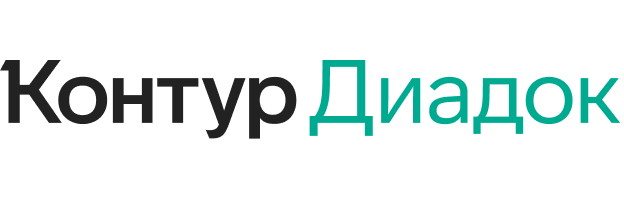

Документация Диадок API
=======================

|image0|

Диадок – это система обмена юридически-значимыми электронными документами между организациями. Диадок позволяет компаниям обмениваться со своими клиентами, поставщиками, партнерами, удаленными подразделениями любыми документами.

Базовым уровнем интеграции с Диадоком является его **HTTP-API** интерфейс. Этот уровень являетсся наиболее общим, и на нем, в частности, обеспечивается платформо-независимость для интеграционных решений.

Это значит, что с **HTTP-API** могут работать как клиенты, написанные на языке C# под платформу .NET и запускающиеся на машинах с ОС Microsoft Windows, так и клиенты, написанные на Java или C++, запускающиеся на машинах под управлением ОС Linux.

Для разработчиков, занимающихся интеграцией Диадока с различными программными продкутами, построенными на платформе 1С, доступен специальный внешний компонент, который позволяет максимально быстро решать типовые задачи, возникающие при стыковке 1С-решений с Диадоком.

Этот компонент написан на языке C++ и не содержит лишних зависимостей, что позволяет использовать его на любой Windows-системе, не требуя установки каких-либо дополнительных модулей.

.. toctree::
   :name: main
   :maxdepth: 1
   :caption: Общее описание возможностей

   Обзор возможностей API <Overview>   
   Возможности для интеграции <IntegrationOptions>
   Модель данных <DataModel>
   Порядок работы с API <ApiClientOperationPrinciple>   
   Управление списком активных контрагентов <Counteragents>
   Документооборот УПД <UtdDocflow>
   Документооборот электронных счетов-фактур <InvoiceDocflow>
   Неформализованный документооборот <NonformalizedDocflow>   
   Дополнительные функции API <MiscellaneousApiFeatures>   

.. toctree::
   :name: examples
   :maxdepth: 1
   :caption: Примеры использования
   
   Как авторизоваться в системе <howto/example_authorization>
   Как отправить счет-фактуру <howto/example_send_invoice>
   Как получить счет-фактуру <howto/example_receive_invoice>
   Как отправить и получить товарную накладную ТОРГ-12 <howto/example_torg12>
   Как отправить и получить акт о выполнении работ/оказании услуг <howto/example_acceptance_certificate>

.. toctree::
   :name: work
   :maxdepth: 1
   :caption: Техническая документация

   Структуры данных <DataStructures>
   Авторизация <Authorization>
   Работа с УПД <API_UniversalTransferDocument>
   Работа с СФ/ИСФ/КСФ <API_Invoices>
   Работа с документами <API_Documents>
   Работа с сообщениями <API_Messages>
   Работа с событиями <API_Events>
   Работа с организациями <API_Organizations>
   Работа с контрагентами <API_Counteragents>
   Docflow API <Docflow API>
   Облачная подпись <CloudSignApi>

.. rubric:: Справочное руководство

-  :doc:`Справочник HTTP-интерфейсов <http_methods>`
-  :doc:`Справочник структур данных <protos>`
-  :doc:`Список HTTP-интерфейсов и структур данных <lists>`

..
  .. toctree::
     :name: tech
     :maxdepth: 1
     :caption: Справочное руководство
     
     http_methods
     protos
     lists

.. toctree::
   :name: others
   :caption: История изменений
   :titlesonly:
   
   ReleaseNotes

