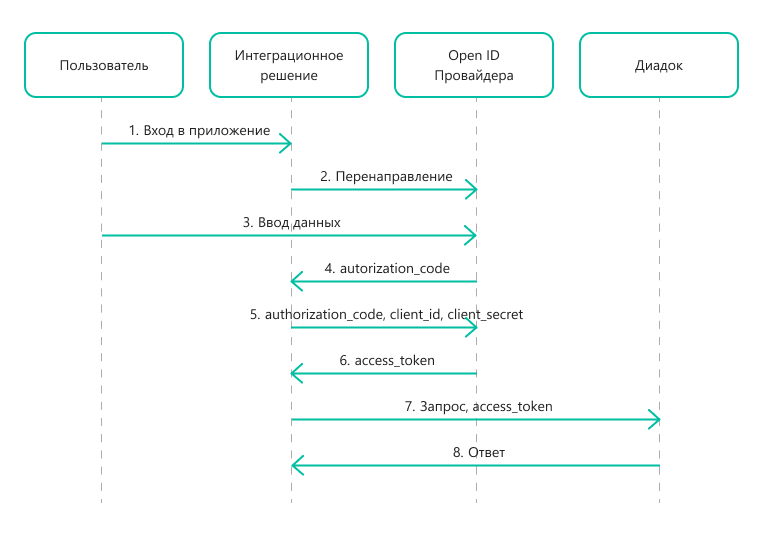

Как работает OpenID Connect
===========================

.. contents:: :local:
	:depth: 3

Принцип работы
--------------

В Диадоке авторизация по протоколу `OpenID Connect <https://openid.net/connect/>`__ происходит с помощью сервиса `OpenID Провайдер <https://developer.kontur.ru/Docs/html/index.html>`__ — аутентификационного сервера, который выдает ключ доступа к продукту —  авторизационный токен.

Авторизационный токен (``access_token``) — это идентификатор, который позволяет идентифицировать пользователя и выполнять действия от его имени в API. Его нужно передавать в методы API Диадока в HTTP-заголовке ``Authorization``:

::

    Authorization: Bearer <access_token>

Например, HTTP-запрос на получение списка доступных пользователю ящиков будет выглядеть так:

::

    POST https://diadoc-api.kontur.ru/GetMyOrganizations HTTP/1.1
    Host: diadoc-api.kontur.ru
    Authorization: Bearer <access_token>

Для получения токена через OpenID Connect нужно иметь:

	- ключ разработчика ``client_secret`` — уникальный идентификатор интегратора в формате GUID. Это секретный ключ, не передавайте его третьим лицам.
	- идентификатор приложения ``client_id`` — идентификатор, позволяющий определить приложение.

Порядок взаимодействия сторон
-----------------------------

Порядок взаимодействия сторон при этом способе авторизации выглядит следующим образом:

#. Пользователь входит в интеграционное решение.
#. Интеграционное решение перенаправляет пользователя в сервис OpenID Провайдера.
#. Пользователь вводит свои данные для авторизации.
#. OpenID Провайдер предоставляет интеграционному решению временный авторизационный код ``authorization_code``.
#. Интеграционное решение отправляет в OpenID Провайдер ``authorization_code``, ``client_id`` и ``client_secret`` для обмена на токен ``access_token``.
#. OpenID Провайдер возвращает интеграционному решению токен ``access_token``.
#. Интеграционное решение передает ``access_token`` в заголовке ``Authorization`` в методы API Диадока.
#. Диадок возвращает ответ метода API интеграционному решению.

Проверка прав пользователя
--------------------------

Методы, работающие с определенным ящиком, контролируют доступ к нему по следующему алгоритму:

1. Диадок извлекает из HTTP-заголовка ``Authorization`` значение параметра ``access_token``. С его помощью определяется идентификатор пользователя. Если какое-то действие не удалось выполнить, метод вернет код ошибки ``401 (Unauthorized)``. Это возможно в следующих случаях:

 - в запросе отсутствует HTTP-заголовок ``Authorization``,
 - в HTTP-заголовке ``Authorization`` не указан access_token,
 - токен поврежден или просрочен.

2. По идентификатору пользователя Диадок находит ящики, к которым у пользователя есть доступ. Список ящиков совпадает со списком, который вернет метод :doc:`http/GetMyOrganizations`.
3. Сервер извлекает идентификатор ящика из параметров запроса. Если идентификатор ящика не входит в список ящиков, доступных пользователю, метод вернет код ошибки ``403 (Forbidden)``.

----

.. rubric:: См. также

*Инструкции:*
    - :doc:`../Authorization`